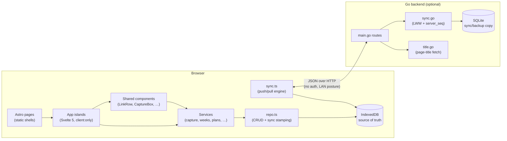
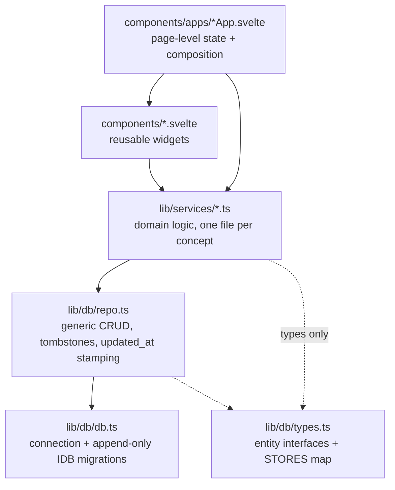
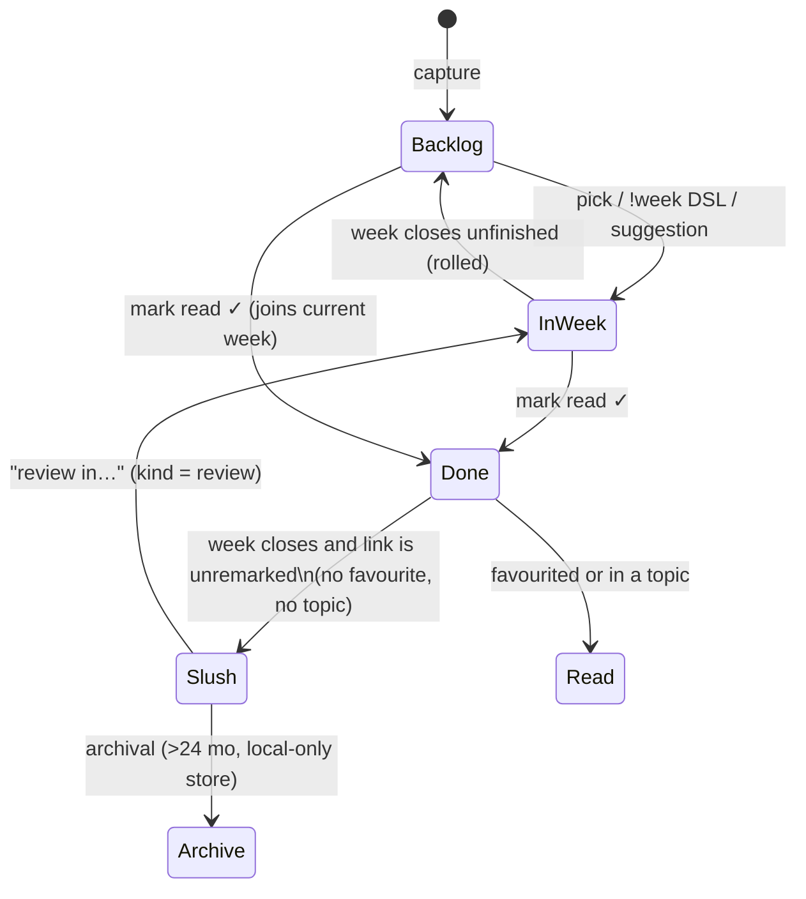

# Architecture

readerr is a **local-first** reading-list and notes manager. The browser owns
the data (IndexedDB is the source of truth); a small Go server exists only as
a sync/backup target and for the few things a browser can't do (fetching page
titles cross-origin). You can delete the server and lose nothing but sync.

This document is the map: how the pieces fit, and where to find everything.
Companion docs: [data-model.md](data-model.md), [sync.md](sync.md),
[link-dsl.md](link-dsl.md), [offline-support.md](offline-support.md).

## The big picture



Three rules keep the whole thing coherent:

1. **IndexedDB is canonical.** Every feature works with the server absent.
   The server never serves app reads — it only receives pushes, answers
   pulls, and hands back the SQLite file as a backup.
2. **Sync is last-write-wins per row** on a client-set `updated_at`
   timestamp, ordered by a single server-side counter (`server_seq`).
   Deletes are tombstones (`deleted_at`), never hard deletes, so they sync.
3. **Markdown is the storage format** for all prose (`*_md` fields), which
   makes the export-to-markdown feature string assembly rather than
   conversion.

## Repository layout

```
readerr/
├── backend/                  Go 1.25, stdlib HTTP + modernc.org/sqlite
│   ├── main.go               routes, CORS, gzip middleware, env config
│   ├── sync.go               table metadata + push/pull/stats/reset handlers
│   ├── title.go              GET /title — server-side page-title extraction
│   ├── db.go                 schema bootstrap + user_version migrations
│   └── sql/schema.sql        canonical DDL (fresh databases get this whole file)
├── frontend/
│   ├── astro.config.mjs      Astro 7, static output, Svelte integration
│   ├── public/
│   │   ├── sw.js             service worker (offline shell cache)
│   │   └── manifest.webmanifest  PWA install manifest
│   ├── src/
│   │   ├── pages/*.astro     one file per route; thin shells only
│   │   ├── layouts/Layout.astro  <head>, theme boot, navbar, onboarding gate
│   │   ├── components/       shared Svelte widgets
│   │   │   └── apps/         one "App" island per page (the real UI)
│   │   ├── lib/
│   │   │   ├── db/           IndexedDB layer (connection, repo, exports)
│   │   │   ├── services/     domain logic (capture, weeks, plans, …)
│   │   │   ├── sync.ts       client sync engine
│   │   │   ├── theme.ts      theming engine (tokens, compile, import/export)
│   │   │   ├── paths.ts      base-path-aware href() helper
│   │   │   └── importKind.ts backup-vs-theme file sniffing
│   │   └── styles/           theme.css (design tokens) + global.css
│   └── test/                 vitest suites + backup fixtures
├── docs/                     reference docs (you are here)
│   └── experiments & plans/  design notes + working task lists
├── .github/workflows/        CI: docker.yaml (image → GHCR), astro.yaml (Pages)
├── Dockerfile                single image: Go binary serving the built frontend
├── docker-compose.yml        ready-to-go deploy (published image, ./data bind mount)
└── docker-compose.build.yml  build-from-source variant
```

Deployment (image, compose, volumes, CI, HTTPS) is its own guide:
[deployment.md](deployment.md).

## Frontend

### Astro MPA + Svelte islands

The app is a **multi-page app**, not a SPA. Each route is an `.astro` file in
`frontend/src/pages/` that renders [Layout.astro](../../frontend/src/layouts/Layout.astro)
and mounts exactly one Svelte island from `components/apps/` with
`client:only="svelte"`. Navigation between pages is a full page load; islands
are torn down and re-created. Consequences worth internalizing:

- **Islands don't share memory.** Cross-island communication uses DOM
  CustomEvents (`SYNC_EVENT` in [sync.ts](../../frontend/src/lib/sync.ts)) or
  just IndexedDB + a refresh on mount.
- **In-progress UI state dies on navigation** — anything that must survive
  goes to IndexedDB or localStorage.
- Editors flush pending autosaves on `pagehide`/`visibilitychange`
  ([MarkdownEditor.svelte](../../frontend/src/components/MarkdownEditor.svelte)).

`Layout.astro` also runs two inline scripts on every page: the theme boot
(applies compiled theme CSS from localStorage before first paint) and the
**first-launch gate** (no `onboarding_completed_at` in settings and no links →
redirect to `/onboarding/`). It conditionally mounts the global
[CaptureFab](../../frontend/src/components/CaptureFab.svelte) on pages that don't
declare `hasCapture` (the Reading List, Backlog, and `/week` alias do — they
have inline capture boxes).

### Route → island map

| Route | Island | Purpose |
|---|---|---|
| `/` (and `/week` alias) | `WeekApp` | Reading List: capture, weekly entries, prev/next week, close week |
| `/backlog` | `BacklogApp` | capture + unread triage queue, bulk operations |
| `/favourites`, `/resources`, `/slush`, `/archive` | respective apps | filtered link listings |
| `/link?id=` | `LinkApp` | per-link notes, excerpts, labels, history |
| `/tags`, `/tag?id=`, `/topics`, `/topic?id=` | respective apps | label indexes + documents |
| `/resource-list?id=` | `ResourceListApp` | list membership + exports |
| `/plan`, `/upcoming` | `PlanApp`, `UpcomingApp` | triage automation + week calendar |
| `/stats` | `StatsApp` | origin/history/storage statistics |
| `/settings` | `SettingsApp` | theme, sync, backups, archival, danger zone |
| `/onboarding` | `OnboardingApp` | first-launch walkthrough (`?page=N` deep-links) |

### Layering

Dependencies point strictly downward:



- **[repo.ts](../../frontend/src/lib/db/repo.ts)** is the only writer of sync
  bookkeeping: `withSyncFields()` mints ids and the sync trio, `put`/`bulkPut`
  re-stamp `updated_at`, `softDelete` writes tombstones, and every read
  filters tombstones out. It also normalizes rows through a JSON round-trip
  (`toPlain`) because **Svelte 5 `$state` proxies fail IndexedDB's structured
  clone** — a DataCloneError class of bug that once silently broke saving.
- **Services** own the domain rules. The important ones:
  - [capture.ts](../../frontend/src/lib/services/capture.ts) — paste parsing,
    dedupe, existing-URL merging, title fetching (see [link-dsl.md](link-dsl.md))
  - [links.ts](../../frontend/src/lib/services/links.ts) — label assignment,
    read/favourite/resource toggles, `markLinkDone` (the lifecycle heart)
  - [weeks.ts](../../frontend/src/lib/services/weeks.ts) — weekly reading list
    lifecycle: open weeks, entries, close/auto-close, suggestions
  - [plans.ts](../../frontend/src/lib/services/plans.ts) — triage defaults +
    scheduled per-week/month overrides
  - [archive.ts](../../frontend/src/lib/services/archive.ts) — yearly archival
    (moves cold slushed links to a local-only store; see the
    `archived_links` store in [data-model.md](data-model.md))
  - [syncLog.ts](../../frontend/src/lib/services/syncLog.ts) — local sync history
- **Widgets** worth knowing: [LinkRow](../../frontend/src/components/LinkRow.svelte)
  (the universal link row: toggles, inline label editor, scheduled-week badge),
  [CaptureBox](../../frontend/src/components/CaptureBox.svelte) (paste box + DSL
  autocomplete + "Just Added" list),
  [BulkActionsPanel](../../frontend/src/components/BulkActionsPanel.svelte)
  (batch operations over a selection), and
  [MarkdownEditor](../../frontend/src/components/MarkdownEditor.svelte)
  (Milkdown Crepe WYSIWYG with a CodeMirror source-mode bailout).

### The reading lifecycle

Most feature logic hangs off one state machine (enforced by
`links.ts`/`weeks.ts`, not by a status column — state is derived from
`read_at`, `slushed_at`, week entries, and labels):



## Backend

Four files, stdlib only, no auth (single-user LAN posture — see the CORS and
SSRF comments in the source):

- **[main.go](../../backend/main.go)** — route table, permissive CORS, gzip
  middleware on `/sync/pull`, `STATIC_DIR` file serving so one origin can
  serve app + sync, `DB_PATH`/`PORT` env config.
- **[sync.go](../../backend/sync.go)** — the `tables` metadata map (columns,
  bool/JSON column marshalling) that must mirror `schema.sql` and the
  frontend `STORES` map, plus handlers: `POST /sync/push`, `GET /sync/pull`
  (with `limit` paging), `GET /sync/stats`, `POST /sync/reset`,
  `GET /backup`. Details in [sync.md](sync.md).
- **[title.go](../../backend/title.go)** — `GET /title?url=`: fetches a page
  server-side (browsers can't cross-origin), extracts `og:title` or
  `<title>` by scanning the body in 256 KB chunks up to 2 MB (YouTube puts
  its title past byte 640k), logs every request with an outcome reason.
- **[db.go](../../backend/db.go)** — opens SQLite (WAL, busy timeout), applies
  [schema.sql](../../backend/sql/schema.sql) wholesale on fresh databases, and
  steps `PRAGMA user_version` through the append-only `migrations` array
  otherwise.

## Cross-cutting patterns

- **Three definitions in lockstep.** Any schema change touches
  `backend/sql/schema.sql` **and** a `backend/db.go` migration **and**
  `frontend/src/lib/db/types.ts` (+ possibly an IDB migration in `db.ts`)
  **and** the `tables` map in `backend/sync.go`. Grep for an existing column
  (e.g. `capture_tag_sort`) to see all four touch points.
- **Append-only migrations, both sides.** Never edit a shipped migration;
  add a new one. IDB is at v7, SQLite `user_version` at 13.
- **Local-only stores** (IDB stores with no SQL twin, excluded from
  `STORES`): `sync_meta` (cursors), `archived_links` (cold storage),
  `sync_log` (diagnostics). See [data-model.md](data-model.md).
- **Base-path awareness.** Every app-absolute URL goes through `href()` in
  [paths.ts](../../frontend/src/lib/paths.ts) so the app works hosted at `/` or
  under a sub-path.
- **Experiments live on their own pages.** New risky features are built as
  isolated components + a test page (`/fab-test`, `/dsl-auto-complete`,
  `/bulk-operations-test` historically), then either graduate into the main
  components or get deleted wholesale.

## Development workflow

- `.claude/launch.json` defines dev servers: `backend` (Go, :8080),
  `frontend` (Astro dev, :4323), `frontend-preview` (serves the built
  `dist/`, :4324).
- **Tests:** `cd frontend && npm test` — vitest over `frontend/test/`, using
  `fake-indexeddb` for data-layer tests and JSON fixtures in
  `test/fixtures/` for backup round-trips. Backend: `go vet ./... && go
  build ./...` (no Go test suite yet).
- **Build:** `npm run build` produces a static site the Go server (or any
  static host) serves; `docker compose up` builds the single image.
- **Demo data:** Settings → Danger zone can seed a configurable multi-year
  dataset ([seed.ts](../../frontend/src/lib/db/seed.ts)) for scale testing.

## Where to look when…

| You want to… | Start at |
|---|---|
| add a field to an entity | `sql/schema.sql` → `db.go` migration → `types.ts` → `sync.go` tables map |
| change paste/capture behavior | `services/capture.ts` (+ `captureDsl.ts` for the DSL) |
| change the weekly flow | `services/weeks.ts`, `apps/WeekApp.svelte` |
| touch sync | `lib/sync.ts` + `backend/sync.go` + [sync.md](sync.md) |
| add a settings knob | `types.ts` UserSettings → `services/settings.ts` pick → `SettingsApp.svelte` → schema/migration/sync map |
| adjust theming | `lib/theme.ts` + `styles/theme.css` |
| ship or deploy an image | [deployment.md](deployment.md), `Dockerfile`, `.github/workflows/docker.yaml` |
| understand sync scaling | the transport-bounds section of [sync.md](sync.md) |
