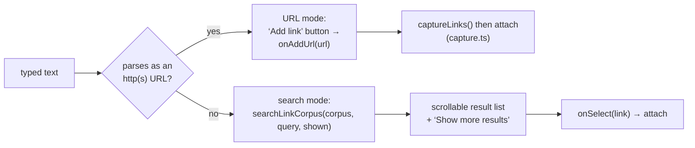
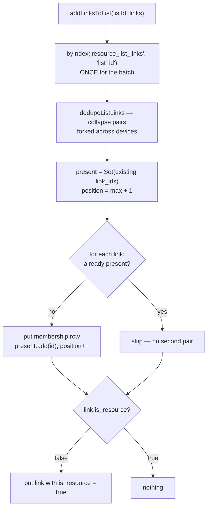
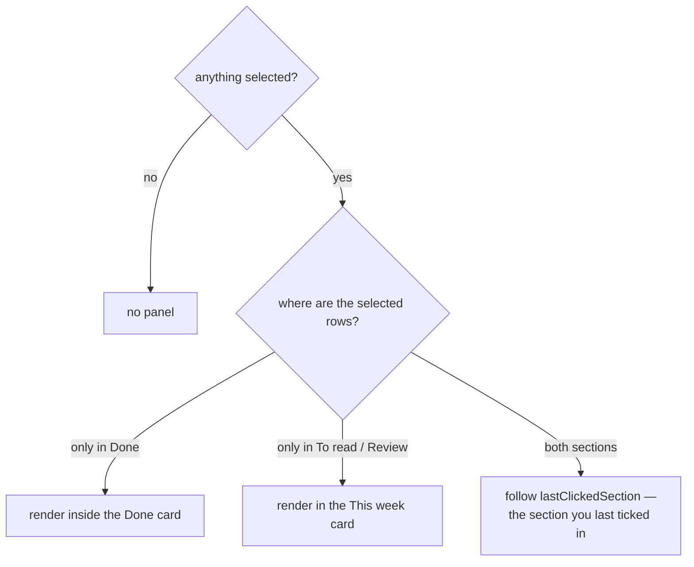

# Bulk operations & the link picker

Two adjacent pieces of the "act on links you already have" surface:

- **[LinkSearchPicker](../../frontend/src/components/LinkSearchPicker.svelte)** —
  the *"Paste a URL to add, or search your links…"* box used by the reading
  list, topic pages, and resource lists.
- **[BulkActionsPanel](../../frontend/src/components/BulkActionsPanel.svelte)** —
  batch operations over a checkbox selection.

Both are shared components with per-page wiring; the pages own the data and
the selection, the components own the interaction.

---

## LinkSearchPicker

### One input, two modes

What you type decides the mode, and nothing else does:



Three pages had a copy of this markup, each with a hard `.slice(0, 8)` and no
way to reach the ninth result — on a library of a few thousand links the link
you wanted was routinely unreachable. The shared component pages instead:
**25 rows per page**, the list capped at `22rem` with `overflow-y: auto`, and
a **Show more results** button that widens the page by another 25.

Widening rather than offsetting is deliberate: the rows already on screen keep
their positions, so the list never reshuffles under a click in progress.

### The scan is lazy

[`searchLinkCorpus`](../../frontend/src/lib/services/links.ts) is the pure
model behind the list:

```ts
searchLinkCorpus(corpus, query, limit, { exclude, accept, tagsByLink })
  → { results: Link[], hasMore: boolean }
```

It walks the corpus and **stops one row past the requested page** — enough to
know `hasMore`, without counting or materialising the rest. Cost tracks what
is displayed, not what is stored, which is the same rule the rest of the app
follows (see [performance.md](performance.md): page slowness at scale is
almost always a helper reading a whole table).

Matching is `matchesSearch`, shared with the list pages, so "matches" means
one thing across the app. Tag names participate only for links present in the
optional `tagsByLink` map — no caller reads the whole `link_tags` table just
to build one.

### Corpus ownership

The component never loads data; the host passes `corpus` in. That is what lets
[WeekApp](../../frontend/src/components/apps/WeekApp.svelte) keep its lazy
`ensureCorpus()`: the reading list holds thousands of links but most visits
never type in the box, so the corpus loads on the picker's **first focus**
(`onFocus`), not on mount.

| Host | `corpus` | `exclude` | `accept` |
|---|---|---|---|
| `WeekApp` | lazy, on first focus | this week's entries | not slushed |
| `TopicApp` | loaded with the topic | links already assigned | — |
| `ResourceListApp` | loaded with the list | current members | — |

Tests: [linkSearchPicker.test.ts](../../frontend/test/linkSearchPicker.test.ts)
(paging boundaries, exclusions, and a counted-iteration test pinning that a
25-row page visits 26 rows of a 5,000-link corpus).

---

## BulkActionsPanel

### Op-groups

Tags · Topics · **Resource lists** · Flags · Reading week. Each group collects
a selection (`ChipSelect`) or a value, then applies it to every selected link
and calls `onApplied` so the host can refresh.

Most groups run per-link (`forSelected`). Resource lists run **per-list, once
for the whole batch** (`forSelection`) — see below.

### Resource lists: one index read per batch

[`addLinksToList`](../../frontend/src/lib/services/resourceLists.ts) is the
bulk entry point, and `addToList` now delegates to it so there is one
implementation:



Three things this shape buys:

1. **No per-link scan.** A fifty-link selection used to mean fifty `byIndex`
   scans of `resource_list_links`; it is now one.
2. **The pair invariant holds.** `resource_list_links` is logically one row
   per `(list, link)` pair but keyed by a random UUID, so a careless bulk add
   mints duplicates the sync harness catches as `resource_list_links-pair`
   (see [data-model.md](data-model.md) on logical singletons keyed by UUID).
   `present` carries forward *within* the batch, so a link that appears twice
   in one call — or is already a member from another device — still produces
   exactly one pair. The deduping read heals an existing fork rather than
   adding a third row to it.
3. **Membership implies resource-hood.** Every added link gets
   `is_resource = true`, whether or not the pair itself is new: lists are the
   organizational layer over the flat ⚒ resources view.

`removeLinksFromList` is the mirror, and deliberately leaves `is_resource`
alone — the link is still reference material, it is just no longer in *this*
list (`removeFromList` has always behaved that way too).

Tests: [bulkLists.test.ts](../../frontend/test/bulkLists.test.ts).

### Where the panel renders

Hosts render the panel themselves, which matters on the reading list. It used
to sit at the top of **This week** unconditionally, so ticking boxes down in
**Done** — below Review, and up to fifty rows long — put the controls
somewhere you had to scroll back up to find.

`WeekApp` now picks a home per selection:



Two rules make this predictable:

- Placement uses **unfiltered** Done membership (`doneLinkIds`), so Done's own
  search and filters can't move the panel.
- The panel always operates on the **whole** selection, wherever it is drawn.
  It is a single `{#snippet bulkPanel()}` rendered at one of two sites, so the
  two can't drift apart.

Backlog and Favourites have one section each and are unaffected.
