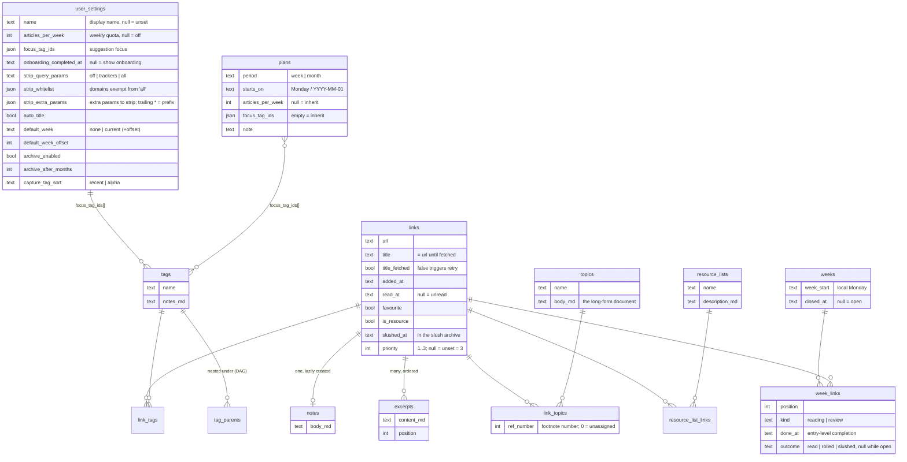

# Data model

The client's IndexedDB is the source of truth; the backend's SQLite is a
sync/backup mirror of the same tables. Three definitions describe the model
and **must stay in lockstep**:

1. [backend/sql/schema.sql](../../backend/sql/schema.sql) — the canonical DDL
2. [frontend/src/lib/db/types.ts](../../frontend/src/lib/db/types.ts) — the TS
   interfaces and the `STORES` map (IndexedDB object stores + indexes)
3. the `tables` map in [backend/sync.go](../../backend/sync.go) — column list +
   bool/JSON wire conversion per table

Adding a field means touching all three, plus a migration on each side
(append-only: `migrations` in [backend/db.go](../../backend/db.go) stepping
`PRAGMA user_version`, and `MIGRATIONS` in
[frontend/src/lib/db/db.ts](../../frontend/src/lib/db/db.ts)). Grep an existing
column like `capture_tag_sort` to see every touch point.

## The sync trio

Every synced row carries:

| Field | Type | Meaning |
|---|---|---|
| `id` | TEXT (UUID v4) | client-generated primary key |
| `updated_at` | TEXT (UTC ISO 8601) | client-set on every write; **last-write-wins compares this** |
| `deleted_at` | TEXT \| null | tombstone — soft-delete only, so deletions sync; every read filters these out |
| `server_seq` | INTEGER \| null | server-assigned global cursor position; null until first accepted |

[repo.ts](../../frontend/src/lib/db/repo.ts) is the only code that manages
these: `withSyncFields()` mints them, `put`/`bulkPut` re-stamp `updated_at`,
`patch` applies a partial update computed against the *current* row,
`putReconciled` persists a reconcile-fold survivor **without** restamping
(see the singleton family below), `softDelete`/`softDeleteMany` write
tombstones, and the reads — `all`/`get`/`byIndex`/`count` — filter tombstones
out (`byIndexWithDeleted` is the deliberate opt-out for readers that need
them). `dedupePairs` collapses duplicate junction rows onto a min-id
survivor. Every write helper also fires the debounced `requestSync()`
([sync.md](sync.md)), so an edit reaches the server within about a second.
repo.ts also runs every row through a JSON round-trip before
writing, because Svelte 5 `$state` proxies fail IndexedDB's structured clone.

## Entities



Design decisions embedded here:

- **Notes are a separate table, not a column on links.** Sync is row-level
  LWW, so the hot `links` row (flag toggles, maybe from a phone) must not
  fight editor autosaves (desktop). Topic bodies and tag notes stay inline
  (`topics.body_md`, `tags.notes_md`) because those rows have no competing
  hot fields.
- **`read_at` is a timestamp, not a boolean** — the week-close logic needs
  it and it's free history. Same for `slushed_at`.
- **Link state is derived, not a status column.** Backlog = `!read_at &&
  !slushed_at`; slush = `slushed_at != null`; the weekly list comes from
  `week_links` rows. The transitions live in
  [links.ts](../../frontend/src/lib/services/links.ts) (`markLinkDone`,
  `toggleRead`, `toggleFavourite`) and
  [weeks.ts](../../frontend/src/lib/services/weeks.ts) (`closeWeek`,
  `reviewLink`, `setLinkWeek`).
- **`week_links` rows are permanent history.** Closing a week stamps each
  entry's `outcome` rather than deleting it; a link's whole reading history
  is queryable (`weekHistoryForLink`).
- **Joins are their own tables** (`link_tags`, `link_topics`,
  `resource_list_links`, `tag_parents`) with soft-deleted rows, so label
  changes sync.
- **Tags nest as a DAG, not a tree.** `tag_parents` holds one row per
  (child, parent) edge, so a tag can sit under several parents; filtering a
  parent returns its descendants' links, de-duplicated by link id. Acyclicity
  cannot be enforced at write time across devices — two devices can each add a
  legal edge that together form a cycle — so every traversal is cycle-tolerant
  and `reconcileTagParents` repairs the graph by dropping the largest-id edge in
  each cycle (device-independent, so devices converge). See
  [experiments & plans/hierarchical-tags.md](experiments%20&%20plans/hierarchical-tags.md).
- **Logical singletons keyed by UUID converge via reconcile.** Several rows
  are logically "one per natural key" — the settings row (a true singleton),
  a plan per `(period, starts_on)`, a note per link, a tag or topic per
  `lower(name)`, a join per `(left, right)` pair — yet each is still stored
  under a random `id`. Two devices
  that each create one *before* syncing mint separate rows, and row-level LWW
  never merges different ids: both go live, and a read that breaks the
  natural-key tie by store/UUID order resolves differently per device. A
  family of guards closes this:
  - **Fixed id** where only one row can ever exist: `user_settings` lives at
    `USER_SETTINGS_ID`, and `getUserSettings` collapses any pre-fix duplicates
    into it ([settings.ts](../../frontend/src/lib/services/settings.ts)).
  - **Reconcile-on-read** where many keys exist: `reconcilePlans` (inside
    `listPlans`, [plans.ts](../../frontend/src/lib/services/plans.ts)) and
    `getNote` ([notes.ts](../../frontend/src/lib/services/notes.ts)) group live
    rows by natural key, fold each group into the **smallest `id`** — a
    device-independent choice, so every device converges on the *same*
    survivor — merge the freshest field values onto it (row-level LWW on
    `updated_at`, `id` as the tiebreak), and tombstone the strays. Idempotent:
    with one row per key they write nothing.
  - **Reconcile with children** when the survivor owns rows in another table:
    `reconcileOpenWeeks` ([weeks.ts](../../frontend/src/lib/services/weeks.ts),
    run from every week read path) folds duplicate *open* weeks sharing a
    `week_start` and additionally re-points the strays' `week_links` onto the
    survivor (dropping any that duplicate a link it already holds). It's the
    highest-impact instance: a freshly-synced device could otherwise show the
    local empty week while its entries hung off the synced twin. Closed weeks
    are excluded — a closed week and a fresh open week legitimately share a
    Monday, so this can't collapse to one fixed id.
  - **Name-merge with children** where the natural key is a user-editable name:
    `reconcileTags` / `reconcileTopics`
    ([links.ts](../../frontend/src/lib/services/links.ts), keyed by
    `lower(name)`, run from `tagsByRecentUse`/`topicsByRecentUse` and the
    tag/topic index + detail pages) fan out widest — the survivor owns join
    rows in *two* tables. They carry the freshest non-empty prose
    (`tags.notes_md`/`topics.body_md`) onto the survivor, re-point
    `link_tags.tag_id`/`link_topics.topic_id` (deduping a `(link_id, survivor)`
    collision to its min-id row; for `link_topics` keeping the survivor's
    footnote number for a shared reference and appending a stray-only one with a
    *fresh* number, so `[^n]` in the kept document stays valid), and rewrite
    merged tag ids out of every `focus_tag_ids` array — `user_settings`
    ([settings.ts](../../frontend/src/lib/services/settings.ts)) and each
    `plans` row ([plans.ts](../../frontend/src/lib/services/plans.ts)).
  - **Per-pair dedupe** for the junction tables (`link_tags`, `link_topics`,
    `resource_list_links`, `tag_parents`), whose natural key is a
    `(left, right)` pair: the
    assign helpers guard only against the local db, so two devices that form
    the same pair each mint a join row — cosmetic duplicate chips and inflated
    counts. `dedupePairs` ([repo.ts](../../frontend/src/lib/db/repo.ts)) groups
    live rows by pair, keeps the **smallest-id** survivor and tombstones the
    rest, surfaced through every join read (`dedupeLinkTags`/`dedupeLinkTopics`
    in [links.ts](../../frontend/src/lib/services/links.ts) /
    [topics.ts](../../frontend/src/lib/services/topics.ts), `dedupeListLinks`
    in [resourceLists.ts](../../frontend/src/lib/services/resourceLists.ts),
    `dedupeEdges` in [tagTree.ts](../../frontend/src/lib/services/tagTree.ts)
    for `tag_parents` edges).
    `link_topics` also keeps the **lowest `ref_number`** so a `[^3]` citation
    stays put. The tag/topic name-merge above re-points these same join rows,
    so it runs **before** the pair-dedupe on every shared read path (reconcile
    at the top, then dedupe), never after.

  Every fold in this family writes its survivor through `putReconciled`
  ([repo.ts](../../frontend/src/lib/db/repo.ts)), which deliberately does
  **not** restamp `updated_at` — stale content folded on a lagging device
  must never outrank a genuine edit under LWW. Because that preserved
  timestamp usually sits below the push watermark, the survivor is also
  recorded in the `pendingRepush` queue and the next push re-sends it by id
  regardless of the watermark — see [sync.md](sync.md).

  When adding a synced table that's "one row per natural key", make identity
  deterministic from that key (a fixed id, or a min-id reconcile) — never rely
  on a random UUID plus a local-only "ensure".
- **`priority` is nullable, and `null` means 3.** Lists sort priority-first
  (1 highest); leaving it unset is the common case, so the column is nullable
  rather than `DEFAULT 3` — that keeps pre-priority rows and older backups
  valid without a backfill. `effectivePriority()` in
  [links.ts](../../frontend/src/lib/services/links.ts) applies the null → 3 rule
  everywhere; the automation suggester (`suggestLinks` in weeks.ts) honors it
  too. It has no SQL twin quirk — just a plain nullable `INTEGER CHECK IN
  (1,2,3)`, added in schema **v14**.
- **`link_topics.ref_number` is issued, never derived.** It is the link's
  footnote number inside its topic — what `[^3]` in the topic document
  resolves to. A new reference takes one past the highest the topic has EVER
  issued, counting tombstoned joins, so removing a reference leaves a hole
  instead of sliding every later citation down by one. Numbering lives in
  [topics.ts](../../frontend/src/lib/services/topics.ts); joins predating the
  column carry `0` and are numbered lazily (oldest first) the first time the
  topic is read, which also catches legacy rows arriving from another
  device. Added in schema **v15**.
- **Footnote definitions are never written into `body_md`.** The document
  stays exactly what was typed; the `[^n]: <url>` list is generated at
  export time from the join rows
  ([topicExport.ts](../../frontend/src/lib/services/topicExport.ts)). A
  citation whose reference was removed degrades to greyed-out plain text
  rather than a broken link.
- **A citation is stored in two spellings, and both must resolve.** Typed in
  source mode it stays `[^2]`; the moment the document passes through the
  WYSIWYG editor, remark-stringify escapes the bracket to `\[^2]` (it reads
  as a link reference). The escape is invisible in the editor and stable —
  it does not compound on further round-trips — so `renderTopicBody` matches
  `/^\\?\[\^(\d+)\]/` and the markdown export strips it. Matching via a
  marked *inline extension* rather than a regex over the document is what
  keeps a `[^1]` inside a code span or fenced block from being linked.

## IndexedDB layout

`STORES` in types.ts defines one object store per SQL table (keyPath `id`)
plus its indexes; migration v1 creates them all, later migrations add stores
and indexes append-only. Current version: **9**.

| Store | Indexes | Notes |
|---|---|---|
| `user_settings` | `updated_at` | singleton at fixed id `USER_SETTINGS_ID`; `getUserSettings` collapses duplicates |
| `plans` | `starts_on`, `updated_at` | one per `(period, starts_on)`; `reconcilePlans` collapses duplicates on read |
| `links` | `url`, `added_at`, `updated_at`, `priority_added` | `url` powers capture dedupe; `priority_added` (v9) is a compound `[priority, added_at]` index — rows with `priority` null are deliberately absent from it (IDB doesn't index null), so the backlog suggester merges it with the `added_at` index |
| `tags`, `topics` | `updated_at` | one per `lower(name)`; `reconcileTags`/`reconcileTopics` collapse duplicates, re-point join rows + `focus_tag_ids` |
| `resource_lists` | `updated_at` | |
| `link_tags`, `link_topics` | `link_id`, `tag_id`/`topic_id`, `updated_at` | |
| `tag_parents` | `child_id`, `parent_id`, `updated_at` | one live row per (child, parent); `reconcileTagParents` drops self-edges, dead refs and cycles |
| `notes`, `excerpts` | `link_id`, `updated_at` | note is one-per-link; `getNote` collapses duplicates on read |
| `resource_list_links` | `list_id`, `link_id`, `updated_at` | |
| `weeks` | `week_start`, `updated_at` | one *open* week per Monday; `reconcileOpenWeeks` collapses duplicates and re-points `week_links` |
| `week_links` | `week_id`, `link_id`, `updated_at` | |

The `updated_at` index on every synced store (migration v7) powers the
dirty-tracked sync push — see [sync.md](sync.md).

Boolean filters (unread/favourite/resource) and priority sorting are
`getAll` + in-memory filter/sort: booleans aren't valid IDB keys, priority is
a small cardinality, and render pagination keeps the working set small. The
one exception is the backlog suggester, which walks the compound
`priority_added` index (plus the `added_at` index for null-priority rows) as
paged cursors instead of scanning — see [performance.md](performance.md).

### Local-only stores (never synced, no SQL twin)

| Store | Created | Purpose |
|---|---|---|
| `sync_meta` | v2 | sync cursors (`lastPushAt`, `lastPullSeq`) + status; excluded from backups |
| `archived_links` | v5 | yearly archival: cold slushed links hard-moved out of `links` so hot paths deserialize fewer rows; **included** in full backups (`LOCAL_STORES` in db.ts) |
| `sync_log` | v6 | sync history diagnostics; excluded from backups |
| `label_usage` | v9 | chip-recency cache for the capture box (last-use per tag/topic id); derived data — excluded from backups, wiped on full restore and rebuilt by a one-time backfill (`labelUsageMap` in links.ts) |

`archived_links` is the deliberate exception to "everything syncs": archiving
hard-deletes from `links` for a real perf win while the *server* keeps the
full history, and archival is deterministic (a function of `slushed_at` age)
so every device converges independently.

## Mapping to the backend

Same tables, same columns, plus the sync trio on every table. The
differences are representational:

```mermaid
flowchart LR
    subgraph IDB["IndexedDB row (JS object)"]
        B1["favourite: true"]
        J1["focus_tag_ids: ['a','b']"]
    end
    subgraph Wire["JSON over /sync/*"]
        B2["true"]
        J2["['a','b']"]
    end
    subgraph SQL["SQLite column"]
        B3["INTEGER 1<br/>(boolCols)"]
        J3["TEXT '[\"a\",\"b\"]'<br/>(jsonCols)"]
    end
    B1 --- B2 ---|toDBValue| B3
    J1 --- J2 ---|toDBValue| J3
```

- `boolCols` per table (e.g. `links.favourite`, `user_settings.auto_title`)
  convert JSON booleans ↔ INTEGER 0/1.
- `jsonCols` (e.g. `focus_tag_ids`, `strip_whitelist`, `strip_extra_params`)
  convert JSON arrays ↔ JSON-encoded TEXT.
- Everything else passes through as TEXT/INTEGER unchanged. Dates are
  strings everywhere: calendar fields are local `YYYY-MM-DD`, `*_at` fields
  are UTC ISO 8601 (which compare correctly as strings — LWW relies on it).
- Server-only: the `sync_state` table (the global `last_seq` counter) and
  `idx_*_seq` indexes for pull.

Migration counters as of this writing: SQLite `user_version` **18** (the
`user_settings.strip_extra_params` column is the latest), IDB version **9**.
Fresh installs
skip migrations — SQLite executes `schema.sql` wholesale, IDB creates the
current `STORES` map in v1 — so both migration chains only run for
pre-existing databases. (Priority added no IDB migration: IndexedDB is
schemaless per record, so a new nullable field just appears on future rows
and reads `undefined` → `null` → 3 on older ones.)

## Other client-side state

Not everything is in IndexedDB. localStorage holds per-device preferences
that shouldn't sync:

| Key | Owner | Purpose |
|---|---|---|
| `readerr-sync-url`, `readerr-sync-mode` | sync.ts | server URL, sync/offline mode |
| `readerr-last-auto-sync` (+ `readerr-session-synced` in sessionStorage) | sync.ts | auto-sync throttle |
| `readerr-theme`, `readerr-theme-config`, `readerr-theme-css` | theme.ts | light/dark pin, theme config, pre-compiled CSS for flash-free boot |
| `readerr-archive-last-run`, `readerr-archive-suggest-dismissed` | archive.ts / ArchiveSuggestModal | archival throttle + one-time prompt |
| `readerr-sync-log-prefs`, `readerr-sync-log-stats` | syncLog.ts | history options + always-on counters |
| `readerr-test-mode`, `readerr-test-bg-sync` | testMode.ts / sync.ts | Playwright-harness seams: freeze background sync and make on-read healers read-only so cross-device snapshots stay deterministic |

## Exports

[export.ts](../../frontend/src/lib/db/export.ts) serializes the model to a JSON
envelope `{ schemaVersion, exportedAt, scope, data: {store: rows[]} }` in
four scopes (full/curated/range/template); **full** includes tombstones and
`LOCAL_STORES` and is the only true backup: importing it clears each store,
nulls every restored row's `server_seq`, and drops both sync cursors and the
remembered server epoch — a fresh baseline against whatever server it syncs
to next. The other scopes merge by id under the same last-write-wins rule
sync uses, so an older imported row never regresses a newer local one.
[export-markdown.ts](../../frontend/src/lib/db/export-markdown.ts) writes the
prose model out as a zip of markdown files — possible precisely because
markdown is the stored format. Backup fixtures used by the test suite live
in [frontend/test/fixtures/](../../frontend/test/fixtures/).
