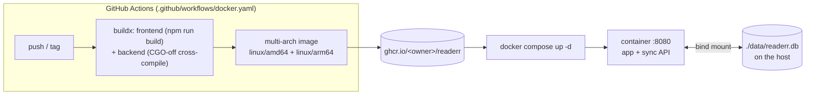

# Deployment

readerr ships as a **single Docker image**: the Go backend serves the built
static frontend and the sync API on one origin, backed by one SQLite file.
There's no separate web server, no database service, and no auth
([architecture.md](architecture.md)) — run it on a LAN or behind a
reverse proxy you trust.



## Quick start (prebuilt image)

The published image lives at **`ghcr.io/descent098/readerr`**. The repo's
[docker-compose.yml](../../docker-compose.yml) is ready to go:

```sh
docker compose up -d
```

That pulls the image, serves the app on **http://localhost:8080**, and stores
the database in **`./data/readerr.db` on the host** (a bind mount — a real
file you can back up or copy out, not a hidden Docker volume). Open the URL,
walk through onboarding, done.

Prefer a one-off `docker run`? Same result:

```sh
docker run -d --name readerr \
  -p 8080:8080 \
  -v "$PWD/data:/data" \
  ghcr.io/descent098/readerr:latest
```

## Configuration

Everything is environment variables; the image sets sensible defaults so the
compose file only needs to override what you want to change.

| Variable | Default (in image) | Purpose |
|---|---|---|
| `PORT` | `8080` | port the server listens on inside the container |
| `DB_PATH` | `/data/readerr.db` | SQLite file location (keep it under the mounted volume) |
| `STATIC_DIR` | `/srv/public` | built frontend to serve; unset it to run sync-only, no UI |

**Changing the host port** — edit the left side of the `ports` mapping:

```yaml
ports:
  - "80:8080"               # serve plain HTTP on the standard port
  - "127.0.0.1:8080:8080"   # localhost only (e.g. behind a reverse proxy)
```

`PORT` changes the *container's* internal port; the `ports` mapping decides
what the host exposes. Leave `PORT` at 8080 unless you have a reason.

## Data, volumes, and backups

The bind mount `./data:/data` puts three files on the host: `readerr.db` plus
its WAL companions `readerr.db-wal` and `readerr.db-shm` (SQLite runs in WAL
mode). To back up:

- **Cold copy:** stop the container (`docker compose stop`), then copy the
  whole `./data` directory. Copying `readerr.db` alone while it's running can
  miss un-checkpointed WAL data.
- **Live copy:** `GET /backup` — the server checkpoints the WAL and streams a
  consistent `.sqlite` file. This is the safe way to snapshot without
  stopping. (Clients also have JSON/markdown exports — see
  [sync.md](sync.md).)

The database is the single source of truth for *synced* data; each browser
still holds its own local-first copy ([data-model.md](data-model.md)), so a
lost server DB costs sync history, not the users' data.

## Building from source

To build the image yourself instead of pulling:

```sh
docker compose -f docker-compose.build.yml up --build
```

or directly:

```sh
docker build -t readerr .
```

The [Dockerfile](../../Dockerfile) is a three-stage build: node builds the
static frontend, go cross-compiles the backend (pure-Go SQLite, `CGO=0`), and
a small Alpine stage assembles the two. Both build stages run on the
`$BUILDPLATFORM` and target `$TARGETPLATFORM`, so a multi-arch build never has
to emulate node or go:

```sh
docker buildx build --platform linux/amd64,linux/arm64 -t readerr .
```

## Continuous delivery

[.github/workflows/docker.yaml](../../.github/workflows/docker.yaml) builds and
publishes the image to GHCR on every push to `main` and every `v*` tag (pull
requests build but don't push). It emits multi-arch manifests and these tags:

| Tag | When |
|---|---|
| `latest` | push to the default branch |
| `<branch>` | push to any other branch |
| `<x.y.z>`, `<x.y>`, `<x>` | pushing a `vX.Y.Z` git tag (semver) |
| `sha-<short>` | every build — use this to pin a deploy exactly |

For reproducible deployments, pin to a release or SHA rather than `latest`:

```yaml
image: ghcr.io/descent098/readerr:v1.0.0
```

**First-time GHCR setup:** the workflow authenticates with the automatic
`GITHUB_TOKEN` (no secrets to configure). After the first successful publish,
make the package public under the repo's *Packages* settings if you want
`docker pull` to work without a login.

## Upgrading

```sh
docker compose pull      # fetch the newer image
docker compose up -d     # recreate the container
```

Schema migrations run automatically on start: the backend steps
`PRAGMA user_version` through its append-only migration list
([data-model.md](data-model.md)), so an older DB is upgraded in place. Roll
back by pinning an older image tag — but note a DB migrated forward may not
open on an older binary, so keep a backup before major upgrades.

## HTTPS, auth, and exposure

There is **no authentication** — the server trusts its network, and CORS is
permissive so a separately-hosted frontend can sync. That's fine for a LAN or
a single user. To expose it to the internet, put it behind a reverse proxy
(Caddy, nginx, Traefik) that terminates TLS and adds whatever access control
you need, and bind the container to localhost (`127.0.0.1:8080:8080`) so only
the proxy can reach it. See [sync.md](sync.md) for the security posture.

## Health

The container has a built-in `HEALTHCHECK` hitting `/healthz`, so
`docker ps` shows `healthy`/`unhealthy` and orchestrators can gate on it. The
same endpoint powers the app's *Settings → Sync → Test connection*.
