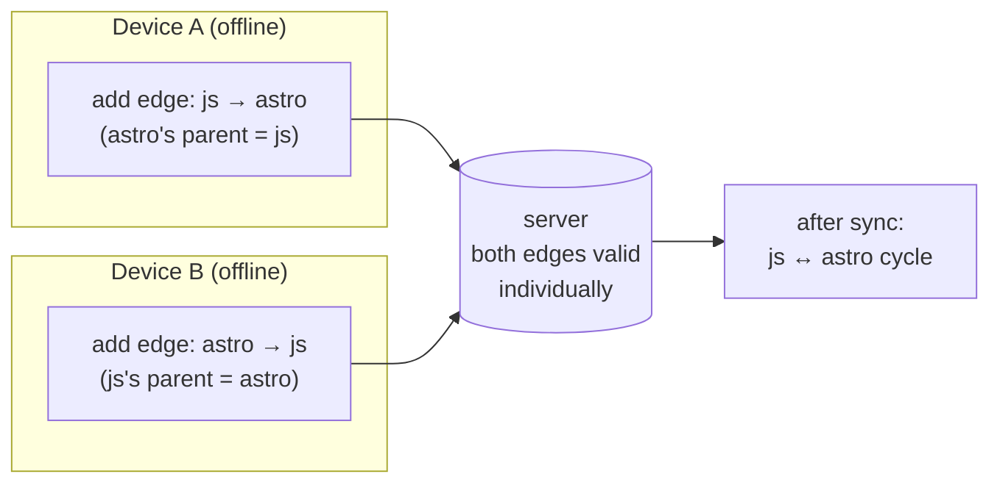
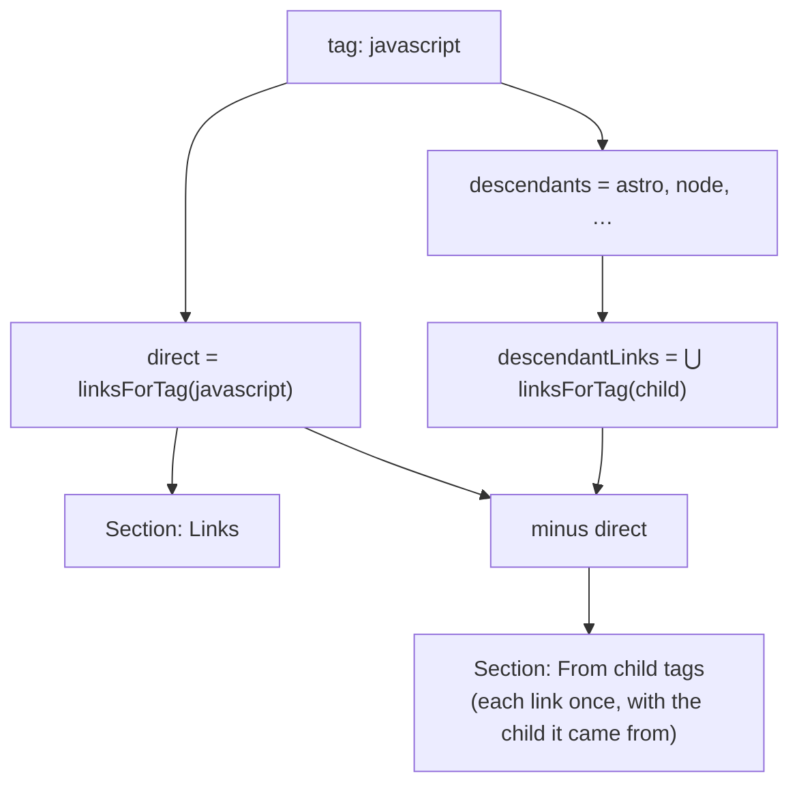

# Hierarchical tags

Let a tag be nested under **one or more** parent tags, so `astro` under both
`javascript` and `webdev` makes every `astro` link show up when you filter for
either parent — without the link ever being tagged `javascript` by hand.

This is a design plan, not shipped code. It is written to fit the app's grain:
local-first, offline-first, and — the part that dominates every decision below —
**synced across devices by whole-row last-write-wins**, which has already cost
this codebase a long list of data-loss bugs
([sync-issues-summary.md](sync-issues-summary.md)).

## 1. Goal

- A tag has zero or more parents; a parent has zero or more children. It is a
  **DAG, not a tree** — `astro` legitimately belongs under `javascript` *and*
  `webdev`.
- Filtering by a tag returns links carrying that tag **or any descendant**.
- A tag's page gains a **"From child tags"** section listing links that arrive
  only through descendants.
- Everything **de-duplicates**: a link explicitly tagged both `javascript` and
  `astro` appears **once**, in the direct list — never twice, and never in both
  sections.

Explicit non-goals for v1: renaming/merging semantics beyond what
`reconcileTags` already does, per-parent ordering, and inheriting *notes*.

## 2. Data model

### 2.1 A junction table, not a column

`tags.parent_id` cannot express multiple parents, so parentage becomes its own
synced table:

```sql
-- backend/sql/schema.sql
CREATE TABLE tag_parents (
    id         TEXT PRIMARY KEY,
    child_id   TEXT NOT NULL REFERENCES tags (id),
    parent_id  TEXT NOT NULL REFERENCES tags (id),
    updated_at TEXT NOT NULL,
    deleted_at TEXT,
    server_seq INTEGER
);
CREATE INDEX idx_tag_parents_child  ON tag_parents (child_id);
CREATE INDEX idx_tag_parents_parent ON tag_parents (parent_id);
CREATE INDEX idx_tag_parents_seq    ON tag_parents (server_seq);
```

This shape is deliberate: it is **structurally identical to `link_tags`**, so it
inherits machinery that already exists and is already tested.

| Concern | Reused from |
|---|---|
| Duplicate `(child, parent)` from two devices | `dedupePairs` in [db/repo.ts](../../../frontend/src/lib/db/repo.ts) — min-id survivor, tombstone the rest |
| Soft delete so un-nesting syncs | `softDelete` / tombstone reads |
| Parents of a merged-away tag | the re-point pass in `reconcileTags` ([links.ts](../../../frontend/src/lib/services/links.ts)) |

Wiring checklist (each of these is a place the codebase has been bitten before
when a table was added and one was missed):

- `STORES` + a new migration in [db/db.ts](../../../frontend/src/lib/db/db.ts)
  (never edit an existing migration — append `DB_VERSION + 1`);
- `tableOrder` **and** `tables` metadata in [backend/sync.go](../../../backend/sync.go)
  — `tag_parents` must sort *after* `tags` so parents land before children;
- a backend schema migration;
- the export/import allow-list in `db/export.ts`;
- the harness's `ALL_STORES` coverage list in
  [tests/sync/reporter.ts](../../../frontend/tests/sync/reporter.ts) — otherwise
  the new store is a **silent coverage hole**, which the reporter is built to
  make loud.

### 2.2 What is NOT stored

**No materialised closure table.** A `tag_closure(ancestor, descendant, depth)`
would make reads O(1) but is *derived* data, and derived data must never sync:
§6.1 of [sync-issues-summary.md](sync-issues-summary.md) is the bug where a
local-only partition resurrects on pull. If closure ever becomes necessary for
performance it must be a **local-only, rebuildable cache** keyed off a content
hash of `tag_parents`, excluded from push/pull the way `archived_links` is —
and that is a later optimisation, not v1.

## 3. The hard part: a DAG under last-write-wins

Row-level LWW can keep individual edges consistent. It **cannot** keep a global
invariant like acyclicity, because a cycle is a property of a *set* of rows that
no single device ever sees mid-flight.



Each edge is individually legal; together they are a cycle. **A validation that
runs only at insert time cannot prevent this.** The same applies to depth
limits, and to "a tag may not be its own ancestor".

The plan therefore treats acyclicity as something to **survive**, not to
guarantee:

1. **Insert-time check (UX, not correctness).** Refuse an edge that would create
   a cycle *given what this device currently knows*. Catches ~all real mistakes,
   and gives an immediate error message. Do not rely on it for correctness.
2. **Cycle-tolerant traversal (correctness).** Every graph walk carries a
   `visited: Set<string>` and a depth cap. A cycle in the data can then never
   hang a page or blow the stack — it just yields a bounded result. This is the
   load-bearing guarantee.
3. **Deterministic repair (convergence).** A `reconcileTagParents()` on the read
   path detects a cycle and breaks it by tombstoning the edge with the
   **largest id** in the cycle. Largest-id is device-independent, exactly as
   `dedupePairs`/`reconcileTags` pick min-id survivors, so two devices that both
   notice the cycle break the *same* edge and converge instead of ping-ponging.
   Use `putReconciled`, not `put`, so the fold never stamps `now` over a newer
   edit (§3.1 of the sync summary).

Two further degenerate cases the reconcile must handle, both reachable *only*
through sync or tag merges:

- **Self-edge** (`child_id === parent_id`): impossible to create in the UI, but
  `reconcileTags` merging `Astro` into `astro` re-points edges and can produce
  one. Tombstone on sight.
- **Edge pointing at a tombstoned tag**: reads already filter tombstones, so
  this is inert — but the reconcile should tidy it so counts stay honest.

## 4. Query semantics

### 4.1 Resolution

```ts
/** tagId plus every descendant, cycle-safe and depth-capped. */
async function tagWithDescendants(tagId: string, maxDepth = 6): Promise<string[]>

/** Direct parents of a tag (for the tag page + the picker). */
async function parentsOf(tagId: string): Promise<Tag[]>
```

BFS over `byIndex('tag_parents', 'parent_id', …)`, `visited` set, depth cap.
Tag counts are in the hundreds at most, so a per-call walk is cheap; resolve
once per page load and pass the id set down rather than re-walking per row.

### 4.2 Every read path that must change

`linksForTag` is not the only one. The plan is only complete if all of these are
updated together, because a half-applied change produces a UI where the list and
the count disagree:

| Function ([links.ts](../../../frontend/src/lib/services/links.ts)) | Change |
|---|---|
| `linksForTag(tagId)` | union over `tagWithDescendants`, de-duped by link id |
| `tagLinkCounts()` | gains an inclusive count alongside the direct one |
| `tagsForLink` / `tagsForLinks` | **unchanged** — see §5.2 |
| focus tags (`effectiveTriage` → `suggestLinks` in [weeks.ts](../../../frontend/src/lib/services/weeks.ts)) | a focus tag should pull in its children, or focusing `webdev` silently ignores the `astro` backlog |
| `FLAG_FILTERS` / list toolbars | any tag filter routes through the same resolution helper |

### 4.3 De-duplication — the explicit requirement

Two distinct de-dupes, easy to conflate:

1. **Row-level.** A link reachable via several paths (tagged `astro`, and
   `astro` sits under both `javascript` and `webdev`) must appear **once**.
   Union into a `Map<linkId, Link>` keyed by id, never concatenate arrays.
2. **Section-level.** On the tag page, a link tagged **both** `javascript` and
   `astro` belongs in **Links**, not in **From child tags**. Compute the direct
   set first, then `From child tags = descendantLinks \ directLinks`.



## 5. UI

### 5.1 Editing parentage

On the tag page ([TagApp.svelte](../../../frontend/src/components/apps/TagApp.svelte)),
a **Parent tags** `ChipSelect` mirroring the existing focus-tag picker: pick
existing tags, create inline. Adding a parent that would form a cycle shows an
inline error and writes nothing.

The tags index ([TagsApp.svelte](../../../frontend/src/components/apps/TagsApp.svelte))
gains optional indentation by primary parent (lowest-id parent, for a stable
device-independent order) plus a flat/nested toggle. A DAG has no single
correct tree rendering; nesting under the primary parent and showing
`also under: webdev` inline is honest and cheap.

### 5.2 Chips stay explicit

`LinkRow` chips continue to show **only explicitly assigned tags**. Rendering
inherited ancestors as chips would double up visually (`astro` + `javascript`
on a link tagged only `astro`) and make "remove this tag" ambiguous —
inheritance is a *query-time* relation, not a label on the row. The tag page's
"From child tags" section carries a small `via astro` marker instead, which is
where that information is actually useful.

### 5.3 Writes must not resurrect the stale-snapshot bug

Every mutation here (`addParent`, `removeParent`) writes through `patch()` in
[repo.ts](../../../frontend/src/lib/db/repo.ts) — re-read, change only the intended
fields, decline the write if the row is gone. That is now the house rule after
audit §7.1; a picker holding a tag snapshot across a background pull is exactly
the shape that caused it.

## 6. Migration and rollout

Additive and backward-compatible: with no `tag_parents` rows the behaviour is
byte-identical to today, so the feature can ship dark.

An **older client** syncing against a server that has `tag_parents` ignores the
table — its pull skips unknown stores. Note the known sharp edge (audit M23):
the pull advances its cursor past rows for stores it does not know, so an old
client that later upgrades needs a full resync to pick them up. `checkServerEpoch`
already provides the mechanism; the rollout note is simply that upgrading
clients should reset local sync state once, as after a server switch.

## 7. Testing plan

Mirrors what the TODO asks for — unit, UI, and cross-device — and follows the
project rule that a fix is done only when its tripwire flips red → green while
the full suite stays green (12/12 sabotage).

**Unit** (`frontend/test/tagHierarchy.test.ts`)
- resolution: single parent, multiple parents, diamond (`astro` under both
  `javascript` and `webdev`, both under `programming` — reached once), depth cap;
- de-dup: link tagged parent *and* child appears once; `From child tags`
  excludes directly-tagged links;
- cycle tolerance: a hand-seeded cycle terminates and returns a bounded set;
- `reconcileTagParents`: breaks a cycle at the max-id edge, drops self-edges,
  is idempotent, and two independently-seeded devices pick the **same** edge;
- `reconcileTags` merging two same-name tags re-points parent edges onto the
  survivor and collapses the resulting duplicate/self edges.

**Cross-device** (`frontend/tests/sync/tag-hierarchy.spec.ts`)
- an edge created on A converges to B and changes B's filter results;
- un-nesting on A tombstones on B (no ghost hierarchy);
- **the cycle case**: A adds `js → astro` offline, B adds `astro → js` offline,
  both sync — assert both devices converge on the *same* surviving edge set and
  neither page hangs;
- both devices create the same edge independently → `dedupePairs` collapses to
  one row, and the three-way oracle agrees.

**Backend** (`backend/sync_test.go`)
- `tag_parents` round-trips with correct column metadata and seq assignment;
- parents-before-children ordering holds in `tableOrder`;
- a legacy row missing the table is skipped, not fatal (the poison-row rule).

**Invariants** ([tests/sync/helpers/invariants.ts](../../../frontend/tests/sync/helpers/invariants.ts))
- add: no live `tag_parents` row may reference a tombstoned tag; no self-edge;
  no duplicate `(child_id, parent_id)` pair among live rows.

## 8. Phasing

1. **Schema + sync plumbing.** Table on both sides, migrations, `tableOrder`,
   export/import, harness coverage list, backend tests. Nothing user-visible.
2. **Resolution + reconcile.** `tagWithDescendants`, `parentsOf`,
   `reconcileTagParents`, invariants, unit tests. Still nothing user-visible.
3. **Reads.** `linksForTag`, counts, focus tags. Filters start including
   children — the first behaviour change, and the one to watch for regressions.
4. **UI.** Parent picker on the tag page, "From child tags" section, nested
   index view.
5. **Optional.** DSL support (`!tags=[javascript/astro]` creating the edge as
   well as the tag) and a local-only closure cache if profiling demands it.

Steps 1–2 are independently shippable and reversible, which is the point: the
risky part of this feature is not the UI, it is that a second synced graph table
gives whole-row LWW a new way to disagree with itself.
