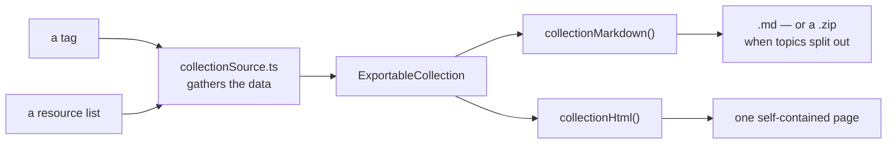
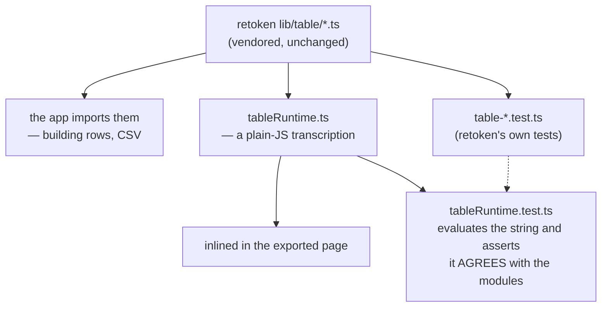

# Exports

readerr writes files in four different shapes, and only two of them share
machinery. Knowing which is which saves you looking in the wrong place:

| Export | Module | Shape |
|---|---|---|
| **Backups** (full / curated / template / range) | [export.ts](../../frontend/src/lib/db/export.ts) | JSON envelope of raw rows — the thing you restore from |
| **Markdown vault** (everything, zipped) | [export-markdown.ts](../../frontend/src/lib/db/export-markdown.ts) | one `.md` per topic / tag / link |
| **A topic** | [topicExport.ts](../../frontend/src/lib/services/topicExport.ts) | its document, its footnotes, its metadata |
| **A collection** — a **tag** or a **resource list** | [collectionExport.ts](../../frontend/src/lib/services/collectionExport.ts) | this document |

---

## The collection core

A tag and a resource list turn out to be the same thing: a title, an about
document, some headline numbers, one or more named sections of links, and some
topics travelling along. So they share everything downstream of that shape.



The split matters: **[collectionSource.ts](../../frontend/src/lib/services/collectionSource.ts)
knows where the data lives, [collectionExport.ts](../../frontend/src/lib/services/collectionExport.ts)
knows how to write it.** Adding a third exportable surface is a new
`collectionForX()` and nothing else.

### What a collection holds

```ts
interface ExportableCollection {
  title: string;
  aboutMd: string;                                  // tag notes / list description
  stats: { key; label; value }[];                   // md frontmatter, HTML header card
  sections: { title; note?; rows: CollectionRow[] }[];
  topics: { topic; refs; tags }[];
}
```

`stats` is written once and read twice — the markdown frontmatter keys and the
HTML header-card labels are the same objects, so the two formats cannot
disagree about how many links a tag has.

### The link table

One column set, both formats
([`LINK_TABLE_SCHEMA`](../../frontend/src/lib/services/collectionExport.ts)):

| Column | Type | Notes |
|---|---|---|
| `link` | str | the **title**, rendered as an anchor to `url` |
| `url` | url | its own column, so the address is filterable too |
| `read` | bool | |
| `favourite` | bool | |
| `resource` | bool | |
| `reading_week` | str | the Monday of the OPEN week it is queued for; blank for a closed one, which is history rather than a schedule |
| `tags` | str | comma-separated |

The plan's spec put the title inside a single `url` column; splitting it in two
is the one deliberate deviation, because a table you cannot search by title is
not much of a table.

**Ordering is fixed: favourites → read → unread, by title within each band.**
Not a user choice — the HTML table sorts on any column anyway, and the markdown
wants one predictable order so two exports of the same data diff cleanly.

Markdown cells escape `|` (it would end the cell) and flatten newlines (a row
is one line). Both are `mdCell()`.

---

## The exported HTML page

One file. No stylesheet, no script, no font to fetch — it has to open from a
disk, offline, months later. The theme's tokens are resolved into a
`light-dark()` stylesheet by `themeCss()`
([htmlExport.ts](../../frontend/src/lib/services/htmlExport.ts)) and inlined.

### Why the table is hand-written JS

retoken's `DataTable.svelte` needs a Svelte runtime, and an exported page has
none. Bundling one per file would mean a build step whose output must also
exist during `astro dev`, plus tens of kilobytes of framework in every export.
The phase-8 plan sanctions the alternative it is written against —
*"reuse the pure model libs with a compact vanilla-DOM renderer inlined in the
export"* — and that is what
[tableRuntime.ts](../../frontend/src/lib/services/tableRuntime.ts) is.



A transcription can drift, and the failure would be silent and remote — an
export sorting differently from what the app showed, found months later. So
`tableRuntime.test.ts` evaluates the runtime string and compares its pure core
against the vendored modules over a matrix of values: every `toText` /
`toNumber` / `toBool` / `isBlank` result, the **sign of every pairwise
comparison in every column**, `contains` / `isTrue` / `isFalse` filtering
against `filterRows`, free-text search against `searchRows`, and the CSV
quoting, document and filename against `csv.ts`.

What the page gives the reader: a search box, a filter control per column (text
box, or a Yes/No/Any select for booleans), click-to-sort headers, a live
"n of m" count, and a **Download CSV** button that exports what is currently
*visible*, with the UTF-8 BOM Excel needs.

### Vendored from retoken

Copy-paste, not a dependency — that is how retoken ships this
([docs](https://kieranwood.ca/retoken/table/)). Four dependency-free modules
in [`src/lib/table/`](../../frontend/src/lib/table/) — `types.ts`, `format.ts`,
`filter.ts`, `csv.ts` — **unchanged**, with a header naming their origin.
Their upstream tests came with them as `test/table-{filter,format,csv}.test.ts`
(113 cases, only the import paths changed); re-syncing from retoken means
re-syncing those too. `to-sql.ts` was skipped: the export filters client-side
and has no database to talk to.

---

## Topics travelling with a collection

Topic **metadata** — name, reference count, status, tags — always goes. The
document itself is opt-in, because a tag with twenty topics would otherwise
produce a very long file:

| Mode | Markdown | HTML |
|---|---|---|
| default | the topic index only | the topic index only |
| embed | sections at the bottom | a modal per topic, opened from the index |
| one file per topic (md only) | a **zip**: the tag's document plus `topics/<name>.md`, each with its own frontmatter | — |

In zip mode the tag's own document keeps the topic index but drops the bodies:
those *are* the files. `tagMarkdownFiles()` returns the file set before
anything touches the DOM, which is what makes it testable
([tagExport.test.ts](../../frontend/test/tagExport.test.ts)).

---

## Sections, and the link that is in two of them

A tag exports two sections: **Links** (tagged directly) and **From child
tags** (reaching it through a nested tag). A link that is *both* appears once,
in Links — `linksFromChildTags()` already excludes the direct set, and
`tagExport.test.ts` pins that the document prints it once.

The second section is omitted entirely when nothing reaches the tag that way,
rather than printing an empty table.

---

## The topic modal starts closed

Worth knowing, because it bit once: the modal's markup carries `hidden`, but
writing `.topic-modal { display: flex }` on the class alone **overrode it** —
an author-origin class rule outranks the user agent's
`[hidden] { display: none }`. Every export with topic embedding therefore
opened under a full-page backdrop that also swallowed clicks.

The rule is now `display: none` by default with
`.topic-modal:not([hidden]) { display: flex }` to lay it out, which no
specificity accident can undo. `collectionExport.test.ts` parses the emitted
stylesheet and asserts both halves; re-introducing the old CSS fails it.

Anything else in an export that relies on `hidden` (`.topic-embed`,
`.topic-store`) has no display rule of its own on purpose — if one ever gains
one, it needs the same guard.

## Security notes

Two things in here handle data that came from the web:

- **The JSON payload** the page carries for each table is escaped so `<` and
  `>` cannot close the `<script>` element early — a link titled
  `</script><script>…` would otherwise execute in the exported page. The escape
  is invisible to `JSON.parse`.
- **CSV formula injection.** A cell starting `=`, `+`, `-` or `@` is prefixed
  with an apostrophe, so opening an export in a spreadsheet cannot run it.
  That is retoken's `csvField`, and the runtime's transcription of it is one of
  the conformance-tested functions.

---

## Tests

| File | Covers |
|---|---|
| [collectionExport.test.ts](../../frontend/test/collectionExport.test.ts) | ordering, the row model, markdown cells and tables, frontmatter, HTML structure, script-escaping |
| [tagExport.test.ts](../../frontend/test/tagExport.test.ts) | gathering: section membership, counts, reading week, topics, the zip file set |
| [tableRuntime.test.ts](../../frontend/test/tableRuntime.test.ts) | the runtime agrees with the vendored model |
| [table-filter / format / csv.test.ts](../../frontend/test/) | retoken's own suite, unchanged |
| [topicExport.test.ts](../../frontend/test/topicExport.test.ts) | the single-topic export |
