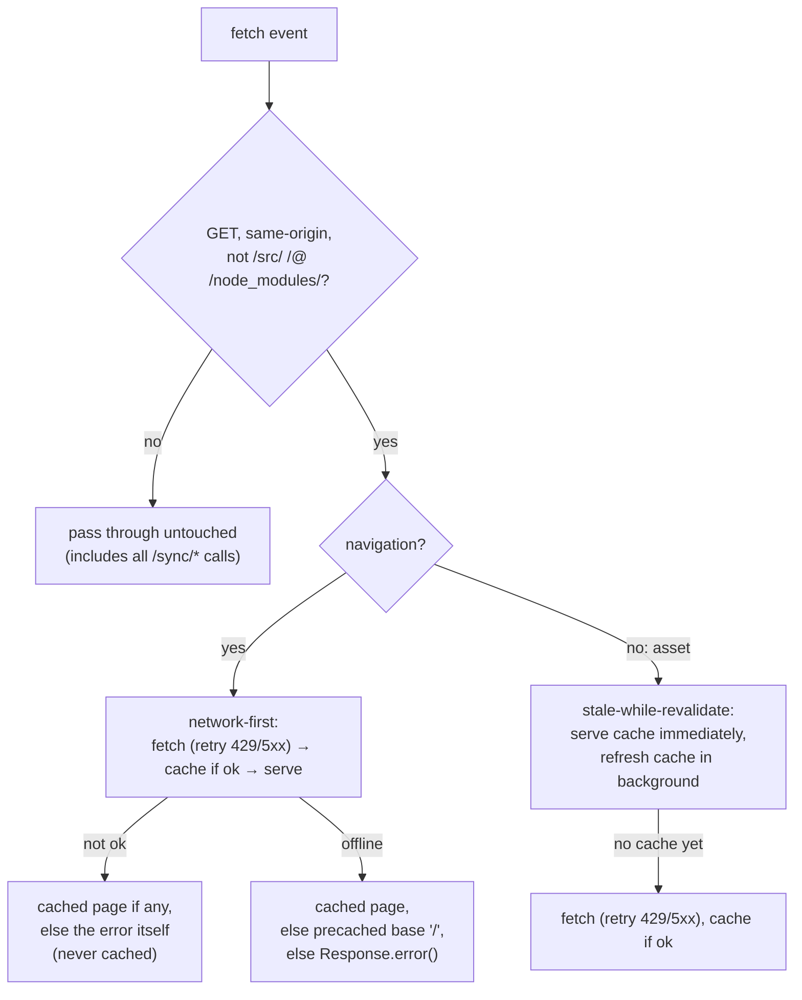
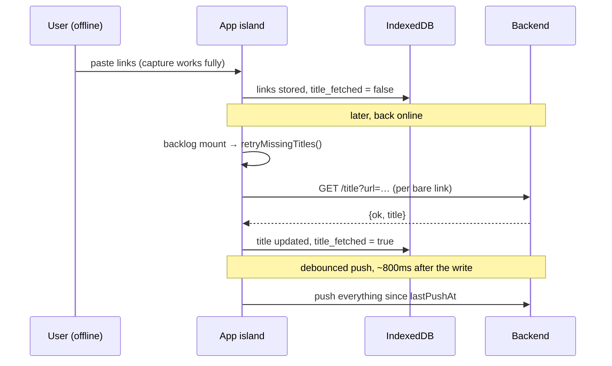

# Offline support

readerr is offline-*first*, not offline-tolerant: the network is an
enhancement, never a dependency. That property falls out of three layers
that are worth understanding separately, because they fail (and recover)
independently:

1. **Data** — IndexedDB is the source of truth; every read and write is
   local. Nothing in the app awaits the network to complete a user action.
2. **Shell** — a service worker caches the static pages/assets so the app
   *loads* without a network.
3. **Enhancements** — sync and title-fetching use the network when it's
   there and degrade quietly when it isn't.

## Layer 1: the data never leaves

All application state lives in IndexedDB ([data-model.md](data-model.md)).
Capturing links, editing notes, closing weeks, theming, exporting — all of
it is local I/O. There is no "saving…" spinner waiting on a server anywhere
in the app; the Go backend is only a sync target
([sync.md](sync.md)) and can be absent forever in **offline mode**.

Two distinct notions of "offline":

| | How it's chosen | What it means |
|---|---|---|
| **Offline mode** | onboarding, or turning the Settings → Sync toggle off (clearing the sync URL does **not** set it — a blank URL just means same-origin) | *policy*: `readerr-sync-mode = 'offline'` in localStorage — no network calls, ever (no sync, no title fetch) |
| **Temporarily offline** | `navigator.onLine` / failed fetches | *circumstance*: network features skip or fail quietly and retry later |

### Durability

Browsers treat IndexedDB as evictable cache (iOS Safari famously wipes it
after ~7 days of inactivity unless installed as a PWA), and on a
no-sync-server setup the browser holds the only copy. So
[persistence.ts](../../frontend/src/lib/db/persistence.ts) requests the
**persistent storage bucket** (`navigator.storage.persist()`) during
onboarding, and the Settings → Storage card surfaces the verdict with a
"request" button and a warning when denied. The Stats page shows
`storage.estimate()` usage. JSON/markdown exports (and a sync server) are
the real safety nets — see the Backup card.

## Layer 2: the app shell loads offline

[public/sw.js](../../frontend/public/sw.js) is a small hand-written service
worker (registered by
[Layout.astro](../../frontend/src/layouts/Layout.astro) **in production
builds only**) plus
[manifest.webmanifest](../../frontend/public/manifest.webmanifest) to make the
app installable as a PWA. It caches only the static shell — it never touches
IndexedDB or sync traffic.

- **Navigations are network-first** so deploys show up on the next load
  when online, with the cached page (then the precached root) as the offline
  fallback.
- **Assets are stale-while-revalidate** — instant loads, background
  freshness.
- `CACHE_VERSION` (`readerr-v3`) names the cache; bump it to invalidate
  everything after a breaking asset change. `activate` deletes old caches
  and claims clients.
- Cross-origin requests and non-GETs (every `/sync/*` POST) bypass the
  worker entirely — offline caching must never make sync state lie.

### Rules this worker follows deliberately

Each of these is a bug that has bitten a sibling project's copy of this
worker; the shapes are easy to reintroduce.

- **`install` precaches the shell and nothing else.** The build emits ~250
  fingerprinted chunks. Crawling the asset graph at install fires hundreds
  of requests in a burst, static hosts rate-limit it (GitHub Pages answers
  `503`), and because the crawl runs while the app is still booting, *the
  app's own lazy imports queue behind the same limit* — so a chunk that
  serves fine to a direct request 503s inside the app. The cache fills as
  you browse instead.
- **Never cache a non-`ok` response.** A 404 or a transient 503 page written
  to the cache becomes that URL's offline copy until the cache is renamed.
- **Never resolve `respondWith()` with `undefined`.** A cache miss whose
  fetch rejects must return `Response.error()`; resolving with a
  non-`Response` makes the browser report a synthetic failure against the
  server, which reads like a host problem rather than a worker bug.
- **Retry `429/500/502/503/504`.** Fingerprinted assets are immutable, so a
  retry is always safe, and a throttle should not look permanent.
- **Bump `CACHE_VERSION` whenever `sw.js` changes meaningfully** — the
  rename is what makes `activate`'s purge run at all, and it is the only way
  to clear a bad entry already stuck in someone's browser.

**Dev mode is the opposite:** Layout.astro *unregisters* any service worker
and clears its caches, because a worker caching Vite's module URLs serves
stale code after edits (blank pages). If the dev server ever behaves
impossibly, a leftover production worker on the same origin is the first
suspect.

The app also works hosted under a sub-path: the worker derives its base from
its own URL, and all app links go through `href()` in
[paths.ts](../../frontend/src/lib/paths.ts).

## Layer 3: network features degrade quietly

### Sync

`maybeAutoSync()` ([sync.ts](../../frontend/src/lib/sync.ts)) returns
immediately when `navigator.onLine` is false or the mode is offline; a
failed `syncNow()` records the error (Settings shows it, the
[sync log](sync.md#sync-history--status)'s *explicit errors* mode ignores
offline-caused ones) and simply waits for the next trigger — a write's
debounced push, session start, the 15-minute throttle, or a manual
**Sync now**. Almost nothing queues: push is
cursor-based ("everything changed since `lastPushAt`"), so however long the
device was offline, the next successful sync carries it all, in bounded
chunks. The exceptions are two small by-id queues in `sync_meta` —
`pendingRepush` (reconcile-fold survivors whose preserved `updated_at` sits
below the push watermark) and `pendingArchivedPush` (archived links the
server has never seen) — drained explicitly by the next push; see
[sync.md](sync.md). The Navbar shows an `offline` badge driven by the
`online`/`offline` window events.

`installSyncFlush` (sync.ts, installed once per page alongside
`maybeAutoSync`) covers the two gaps the debounced push leaves around
connectivity. On `online`, it calls `requestSync()` — writes made while
offline never armed the debounce at all (`requestSync` bails when
`!navigator.onLine`), so reconnecting is what retries them. On `pagehide` /
tab-hidden, it flushes a still-pending debounce immediately — in an MPA
every navigation kills pending timers, so a write made in the last ~800 ms
had an armed timer that would never fire once the page died. This is the
Sunday-night-wifi bug: mark the week's last article done on the phone, close
the browser, and without the flush that completion sits unpushed until the
phone's next visit — by which time another device may have closed the week
from stale state.

### Title fetching

Capture is instant and offline-safe by design: links are stored immediately
with `title = url` and `title_fetched = false`
([capture.ts](../../frontend/src/lib/services/capture.ts)). Resolving real
titles needs the backend (browsers can't read cross-origin pages), so
`fetchTitles`:

- skips entirely when `navigator.onLine` is false,
- skips entirely in offline mode (no backend exists; a client-side fetch
  would be CORS-blocked for nearly every site),
- otherwise fires-and-forgets against `GET /title`, retrying 3× per link and
  logging a console warning when it gives up. A resolved title is written
  through `repo.patch()` — only `title` and `title_fetched` change, computed
  against the *current* row — and a row that already reads `title_fetched`
  (settled elsewhere) or was deleted mid-fetch is skipped rather than
  overwritten or resurrected.

`title_fetched = false` **is** the retry queue: `retryMissingTitles()` runs
on every Backlog mount and re-attempts every bare link, so titles captured
offline resolve themselves the next time the app is online with a backend.

## What to test when touching any of this

- Capture, edit, and navigate with DevTools → Network set to *Offline*:
  everything except title resolution and sync must behave identically.
- Production build + `astro preview`, then go offline and reload: pages
  serve from the worker cache.
- Come back online: titles resolve on the next Backlog visit; the next sync
  tick pushes the backlog of changes (watch the sync log).
- After changing `sw.js`, bump `CACHE_VERSION` and verify old caches are
  dropped on activate.
- Navigate to a URL that 404s, then check the cache does **not** contain it
  (`caches.open(CACHE_VERSION).then(c => c.match('/that-url/'))` must be
  `undefined`) — a cached error page is served offline forever.
- Stopping `astro preview` mid-session is a faithful offline test: a cached
  page must still render, and an *uncached* deep link must fall back to the
  shell rather than a browser error page.
