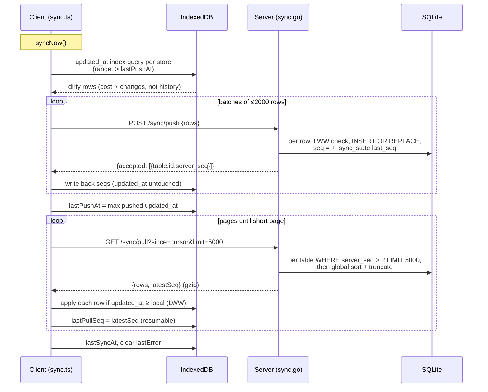

# Sync

readerr is **local-first**: everything lives in your browser's IndexedDB and
the app is fully functional with no server at all. Syncing is optional — a
small Go backend acts as a backup target and a hub that keeps multiple
devices converging on the same data. This document covers every sync-related
feature, then the protocol and implementation for developers.

Code: client engine in [frontend/src/lib/sync.ts](../../frontend/src/lib/sync.ts),
server in [backend/sync.go](../../backend/sync.go). Related docs:
[data-model.md](data-model.md) (what syncs), [offline-support.md](offline-support.md).

## The model in one paragraph

Each device holds a complete copy of the data. A sync is a **push** followed
by a **pull**: the device sends every row it created or changed since its
last push; the server accepts each row under **last-write-wins** (the row
with the newer `updated_at` timestamp wins, per row — not per field) and
stamps it with the next value of a single global counter (`server_seq`). The
pull then asks for "everything past the counter value I last saw", and
applies those rows locally under the same last-write-wins rule. Deletions
sync too: deleted rows become *tombstones* (marked with `deleted_at`, not
removed), so a delete on one device propagates to the others.

What this means in practice:

- **Edits never block.** There are no sync conflicts to resolve by hand; if
  the same item was edited on two devices, the most recent edit wins.
- **Notes are safe from flag flips.** Long-form notes live in their own rows,
  so favouriting a link on your phone can't clobber the note you're writing
  on your desktop.
- **Order doesn't matter.** Devices can sync in any order, any number of
  times; everyone converges on the same state.

## Modes

- **Sync mode** (default): syncs fire from five triggers —
  1. **after every write**, debounced ~800 ms (`requestSync`, fired by every
     repo.ts write helper), so an edit reaches the server within about a
     second and a burst of writes coalesces into one sync;
  2. **on reconnect** (the `online` event) — writes made while offline never
     armed the debounce, so coming back online is what retries them;
  3. **on `pagehide`/tab-hidden**, flushing a still-debounced push
     immediately — in an MPA every navigation kills pending timers
     (`installSyncFlush`);
  4. **once per browser session** and then at most every 15 minutes as you
     navigate (`maybeAutoSync`);
  5. **manually**, via **Sync now** in Settings.

  The backend also resolves page titles for captured links.
- **Offline mode** (chosen in onboarding): no network calls, ever. You can
  opt back in at any time by entering a server URL in Settings.
- **Settings → Sync also has an on/off toggle** — the same
  `readerr-sync-mode` flag, flippable after onboarding. Turning sync off also
  releases the stale-week close gate (below): weeks close from local state
  rather than deferring for a server that will never answer. Entering a
  server URL re-enables sync.

The mode and server URL live in localStorage (`readerr-sync-mode`,
`readerr-sync-url`), not in synced settings — they're per-device by nature.

## Setting up a server

The backend is a single binary (or Docker container) with an SQLite file:

```
DB_PATH=readerr.db PORT=8080 ./readerr
```

Point the app at it under **Settings → Sync**:

- **Blank URL = same origin**, under the app's base path. If the backend
  serves the built frontend (the Docker image does), leave the URL empty.
- Otherwise enter it explicitly, e.g. `http://192.168.1.10:8080`.
- **Test connection** probes the server's `/healthz` and explains common
  failures (wrong path, proxy in the way, server down) in plain terms
  (`describeStatus` in sync.ts).

There is **no auth** — the server trusts its network. Run it on a LAN or
behind whatever access control you already trust (VPN, reverse proxy).

## Onboarding with an existing server

If you already run a backend and are setting up a new device, choose
**Sync from existing server** on the very first onboarding screen, enter the
URL, and hit *Connect & sync*. The device pulls everything — links, notes,
tags, topics, weeks, plans, settings — and lands you on the Reading List.
(Onboarding steps can also be deep-linked: `/onboarding?page=2`. A backup
JSON file can be imported from the same screen.)

## Pointing at a new server: conflict options

Entering a **different** server URL in Settings makes the app probe both
sides (`serverHasData` via `GET /sync/stats`, `localHasData` over the local
stores). Depending on what it finds:

- **Server empty:** your local data simply pushes up. Nothing to decide.
- **Local empty, server has data:** the server copy downloads. This is the
  default — a fresh device just adopts the existing dataset.
- **Both sides have data:** a panel asks you to choose:

  | Option | What happens | Implementation |
  |---|---|---|
  | **Merge both** (recommended) | Server data downloads, combines with local under last-write-wins per item, and the result pushes back. | `resetLocalSyncState()` then `syncFresh()` |
  | **Use server data** | This device is wiped (including local-only data like archived links) and replaced with the server copy. Confirms first. | `wipeLocalData()` then `syncFresh()`, then reload |
  | **Use local data** | The **server** is wiped and repopulated with this device's copy. Other devices syncing to it will converge on this dataset. Confirms first. | `resetServer()` (`POST /sync/reset`) + `resetLocalSyncState()` + `syncFresh()` |

  These flows call `syncFresh()`, not `syncNow()`, deliberately: `syncNow()`
  coalesces into an already-running sync — which captured the *old* server
  URL and cursors when it started — while `syncFresh()` waits out any
  in-flight run and starts a cycle that sees the reconfiguration.

Switching servers always resets the device's sync bookkeeping —
`resetLocalSyncState()` nulls every row's `server_seq` (they were assigned
by the *old* server's counter) and drops both cursors — so the first sync
against the new server exchanges complete datasets rather than assuming
shared history. UI lives in
[SettingsApp.svelte](../../frontend/src/components/apps/SettingsApp.svelte)
(`saveSyncUrl` / `resolveConflict`).

> **Sharp edge (now guarded) — a restarted counter strands other devices.**
> `POST /sync/reset` zeroes the server's `last_seq` counter, and the
> triggering device repopulates from seq 1. Any *other* device still holds a
> high `lastPullSeq`, so it would `pull?since=<high>` and never see the
> repopulated low-seq rows — it silently kept its old data, and rows it
> lacked entirely (e.g. the open week everything's entries point at, stuck at
> seq 2) stayed invisible forever, blanking the week page. The **epoch**
> guard closes this: `sync_state` carries an `epoch` id minted per counter
> lifetime (fresh database, or rotated by `/sync/reset`), returned by
> `/sync/stats`, `/sync/push`, and `/sync/pull`. `syncNow()` probes
> `/sync/stats` first; a changed epoch triggers `resetLocalSyncState()` so
> that sync exchanges complete datasets under LWW instead of trusting dead
> cursors. As a second belt, every reconcile-on-read that folds duplicates —
> `reconcileOpenWeeks`, `reconcilePlans`, `getNote`, `reconcileTags`,
> `reconcileTopics`, and the generic `dedupePairs` (`getUserSettings` always
> did) — persists its survivor via `putReconciled` (repo.ts), which preserves
> the row's own `updated_at` (so stale fold content can never outrank a
> genuine edit under LWW) and records a `store:id` ref in the `pendingRepush`
> queue; the next push re-sends those rows **by id**, regardless of the
> watermark, so the row everything now hangs off still reaches devices whose
> cursor had already passed its original seq. Folds are one-time events, so
> converged data never churns.
> As a third belt, the **server folds duplicate open weeks itself**
> (`reconcileWeeks` in [sync.go](../../backend/sync.go)), inside every push
> transaction: same min-id survivor rule as the client's
> `reconcileOpenWeeks` (so the two never fight), strays tombstoned, entries
> re-pointed, and every touched row re-stamped with a fresh `updated_at` and
> the next `server_seq` — the client pushes before it pulls, so the very sync
> that uploads a twin pulls back the merged week, and offline manual DB edits
> converge on the next sync without SQL surgery.

## Sync history & status

**Settings → Sync** shows the last sync time or the last error (with an
explanation of what the HTTP status likely means). Below it, the
**Sync history** accordion keeps a local log
([syncLog.ts](../../frontend/src/lib/services/syncLog.ts), local-only
`sync_log` store):

- **Track errors**: all errors, only *explicit* errors (failures while your
  device was simply offline are ignored), or none.
- **Keep history for N days** (default 30) — older events are pruned
  automatically.
- **Track successful syncs too** — off by default; background sync runs on
  nearly every page load, so success rows accumulate fast.
- A stat line always tracks totals (errors, successful syncs, last synced)
  in localStorage even when event logging is off; the log paginates at 30.

The history never syncs and is excluded from backups — it's device-local
diagnostics.

## Backups vs sync

Sync is not a backup — a bad edit propagates everywhere. For real backups:

- **Settings → Backup → Export JSON** — a complete client-side snapshot
  (tombstones included); importing one replaces all local data.
- **`GET /backup`** on the server — downloads the SQLite file itself.
- **Export Markdown** — every topic, tag, and link as plain markdown files.

Importing a backup interacts with sync bookkeeping (`importData` in
[export.ts](../../frontend/src/lib/db/export.ts)). A **full restore is a new
baseline**: the stores are cleared, every restored row's `server_seq` is
nulled, and both cursors *and* the remembered server epoch are dropped — so
the next sync exchanges complete datasets with the server instead of
trusting bookkeeping that predates the restore. The merge scopes
(curated/range/template) drop only the **push cursor**, because imported
rows carry historical `updated_at` values the dirty-tracked push would
otherwise skip — the next sync re-scans and re-pushes everything once, and
the server LWW-ignores whatever it already has.

---

# The protocol (developer reference)

## Wire format

**`POST /sync/push`** — body `{ rows: { <table>: Row[] }, final }`, where
`final` is true on the last chunk of a multi-request push (the server runs
its open-week fold only then, once every row of the push has landed). The
server walks tables in parent-before-child order, and for each row: skips it
unless `updated_at` is *strictly newer* than what it holds (LWW), otherwise
`INSERT OR REPLACE`s it stamped with the next `server_seq`. Response:
`{ accepted: [{table, id, server_seq}], conflicts: {table: Row[]},
rejected, latestSeq, epoch }`. `conflicts` carries the server's copy of
every row that lost LWW; the client adopts these locally under its own `>=`
rule — the server *keeps* a tie (its check is `<=` skip) while the client
*adopts* one, so a millisecond tie converges on the server's incumbent
instead of the two asymmetric rules ping-ponging. `rejected` lists rows the
server couldn't store at all (constraint violations).

**`GET /sync/pull?since=N&limit=M`** — every row (tombstones included) with
`server_seq > N`. With `limit`, the M rows with the **globally smallest**
seqs come back and `latestSeq` is the last of them; without it, everything
(older-client compatible). Response:
`{ rows: {table: Row[]}, latestSeq, epoch }`.

Booleans travel as JSON booleans and are stored as SQLite INTEGER 0/1;
array fields (e.g. `focus_tag_ids`) travel as JSON arrays and are stored as
JSON text — the `boolCols`/`jsonCols` sets in sync.go's `tables` map drive
the conversion both ways (`toDBValue`/`fromDBValue`).

## A full sync, end to end



## Transport bounds

- **Dirty-tracked push.** Every synced store has an `updated_at` IDB index
  (migration v7 in [db.ts](../../frontend/src/lib/db/db.ts)); push queries
  `IDBKeyRange.lowerBound(lastPushAt, exclusive)` instead of scanning whole
  stores. Rows the server has never seen have recent `updated_at` by
  construction; the import exception is handled by the cursor drop above.
- **Chunked push** (`PUSH_CHUNK = 2000`). Batch boundaries preserve the
  parent-before-child store order. Accepted seqs are written back per batch;
  `lastPushAt` only advances after *all* batches land, so a mid-push failure
  re-sends the remainder next time — harmless because LWW is idempotent.
- **Paged pull** (`PULL_LIMIT = 5000`). The client loops until a page comes
  back short, persisting `lastPullSeq` per page so an interrupted first sync
  resumes. Server-side, seqs interleave across tables, so a bounded page
  must be the *globally* smallest M — each table is queried with
  `LIMIT M`, then the union is sorted by seq and truncated. Any row cut by a
  per-table LIMIT has a larger seq than at least M returned rows, so
  `latestSeq` can never skip past it.
- **gzip** on `/sync/pull` responses (stdlib middleware in
  [main.go](../../backend/main.go)); `/backup` stays plain because
  `http.ServeFile`'s Content-Length/range handling doesn't mix with
  streaming compression.

## Concurrency: one sync at a time

`syncNow()` never runs two cycles concurrently: an `inFlightSync` promise
coalesces every caller into the run already in progress. Joining is correct
only for callers that need "a completed sync" and changed nothing themselves
(the navbar auto-sync, the week page's close gate). A caller whose own
preceding writes — or reconfiguration of the server URL, cursors, or local
data — must be part of the cycle uses `syncFresh()` instead: it waits out
any in-flight run (which captured the *old* state at its start) and then
starts, or joins, a cycle guaranteed to have begun after the call.
`requestSync`'s debounced push and the Settings/Onboarding server-migration
flows use it for exactly this reason.

Two related helpers: `isSyncing()` is true while a sync is applying rows,
and the on-read reconcilers check it and defer — folding over a half-applied
pull could tombstone a just-pulled week before its child rows land,
orphaning them; the next read after the sync settles reconciles with
complete data. `hasEverReachedServer()` reports whether this device has ever
completed a sync or received an epoch probe answer, which is how the app
tells "server temporarily unreachable" from "this deployment has no server
at all".

## The stale-week close gate

Auto-closing a stale week from local state can overwrite another device's
completions (audit D14): a device offline all week still holds the week
open, and closing it locally stamps every entry `rolled` with fresh
timestamps that then win LWW over the real outcomes. So when sync is
enabled, the week page's init **syncs before it closes**: if
`hasStaleOpenWeeks()`, it awaits `syncNow()` raced against a 10-second
timeout (skipped entirely while offline), and runs `autoCloseStaleWeeks`
only on success — by then the pull has delivered any close recorded
elsewhere, making the local close a no-op. On failure or timeout the close
is **deferred**: the week stays open with a notice, and it retries after the
next successful sync. The manual **Close week** button gets the same gate —
it syncs first (adopting a close recorded elsewhere rather than overwriting
it) and, when the server can't answer, warns explicitly in the confirm
dialog. The deferral applies only when `hasEverReachedServer()`: a device
that has never reached a server (static/serverless deployments run in the
default 'sync' mode) holds the only copy of its data and closes locally as
before, instead of deferring forever. Guards:
`tests/sync/stale-close.spec.ts`.

## Cursors and bookkeeping

Client-side, in the local-only `sync_meta` store:

| Key | Meaning |
|---|---|
| `lastPushAt` | max `updated_at` ever successfully pushed; the dirty-scan floor |
| `lastPullSeq` | `server_seq` high-water mark pulled so far |
| `lastSyncAt` / `lastError` | status for the Settings page |
| `serverEpoch` | the server counter lifetime last seen; a mismatch on the pre-sync `/sync/stats` probe triggers `resetLocalSyncState()` |
| `pendingRepush` | `store:id` refs whose preserved `updated_at` sits below the watermark (fold survivors) — re-sent explicitly |
| `pendingArchivedPush` | ids of archived links the server has never seen (see below) |
| `archivedPushBackfillDone` | the one-time sweep for links stranded before that queue existed has run |
| `labelUsageBackfilled` | the one-time scan that seeded the local-only `label_usage` chip-recency cache has run |

### Archived links and the push

Archival **hard-deletes** a link out of `links` into the local-only
`archived_links` store, and the dirty scan only walks the synced stores. So a
link archived *before its first successful push* had no route to the server at
all: it lived on one device until `resetLocalSyncState()` happened to move it
back. Reachable by a device offline past the archive window, and trivially by
seeding a library with archival enabled.

`archiveNow` therefore queues the ids it moves that carry no `server_seq`, and
the push drains that queue from the cold store, sending them as ordinary
`links` rows inside that store's group (so the parents-before-children chunk
ordering still holds). Three consequences worth knowing:

- the accepted `server_seq` is written back to the **archived** copy — without
  that the row still reads as never-pushed and re-sends forever;
- a cold row rejected under LWW is adopted into the **archived** copy, never
  re-inserted into the hot store — the same rule the pull already applied, and
  only reachable now that cold links are pushed at all;
- a queue is used rather than scanning `archived_links` for `server_seq == null`
  each sync, because the cold store is precisely where a large library goes to
  stop being read. The one-time `archivedPushBackfillDone` sweep covers rows
  stranded by older builds.

Guards: three cases in `tests/sync/archive.spec.ts`, plus the queue unit tests
in `test/archive.test.ts`.

Server-side, one row: `sync_state.last_seq`, the global counter. Rows also
carry their assigned `server_seq`, which is *server-specific* — hence the
nulling in `resetLocalSyncState()` when the device changes servers.

A subtlety worth knowing: pulled rows are written locally with their
original `updated_at`, which may be newer than `lastPushAt` — so the next
push echoes them back once. The server's strict-newer LWW check drops the
echo; it costs a little bandwidth, never correctness.

## Endpoint reference

| Endpoint | Purpose |
|---|---|
| `GET /healthz` | Liveness probe (used by *Test connection*). |
| `POST /sync/push` | Accept client rows (LWW, stamps `server_seq`). |
| `GET /sync/pull?since=N&limit=M` | Rows past the cursor, optionally paged; gzip'd. |
| `GET /sync/stats` | `{latestSeq, epoch}` — cheap "does this server have data?" probe; the epoch also fronts every sync so clients detect counter restarts. |
| `POST /sync/reset` | Wipe all server data, restart the sequence, and rotate the epoch (the *Use local data* option). |
| `GET /backup` | Download the server's SQLite file (WAL-checkpointed first). |
| `GET /title?url=…` | Server-side page-title fetch for captured links. |
| `GET /dbsize` | Server database size in bytes (shown on the Stats page). |

## Tests

Three layers guard sync:

- **Vitest suites** (`cd frontend && npm test`):
  [backup.test.ts](../../frontend/test/backup.test.ts) drives `importData` +
  `syncNow` against an in-memory fake server that mirrors sync.go's LWW/seq/
  limit semantics, over three backup fixtures — it pins the
  import↔push-cursor interplay and the count parity between client and
  server. Reconciler unit tests (`reconcile.test.ts`, `joinDedupe.test.ts`,
  `tagHierarchy.test.ts`, `archive.test.ts`, `staleSnapshot.test.ts`) cover
  the fold rules in isolation.
- **The Playwright multi-device harness** (`cd frontend && npm run
  test:sync`): 17 spec files under `frontend/tests/sync/` drive real
  browsers against a real backend — including a sabotage suite (12 seeded
  bugs the invariants must catch) and an oracle spec — with a reporter that
  enforces store coverage. A change touching sync is done when its tripwire
  flips red → green **and** the full suite stays green with 12/12 sabotage
  detection. Design doc:
  [experiments & plans/sync-testing-framework.md](experiments%20&%20plans/sync-testing-framework.md).
- **Backend Go tests** (`cd backend && go test ./...`):
  [sync_test.go](../../backend/sync_test.go) (push/pull/LWW/fold semantics)
  and [title_test.go](../../backend/title_test.go).

## Troubleshooting

- **"Cannot reach the sync server"** — check the URL, that the server is
  running, and that nothing (firewall, VPN) is between you and it. Offline
  failures are expected and harmless; sync retries on the next interval.
- **404 on sync** — the URL points at something that isn't a readerr
  backend (a plain web server, or a stale URL after moving servers).
- **400 on push** — app and server versions likely disagree; update both to
  the same version.
- **A device shows old data** — edits push within about a second of being
  made, but the 15-minute throttle governs how often a device *pulls* as it
  navigates. Open Settings and hit **Sync now** on the device that's missing
  the change.
- **Moved to a new server and data didn't transfer** — configure the new
  URL in Settings and pick a conflict option; don't copy browser data
  around by hand.
