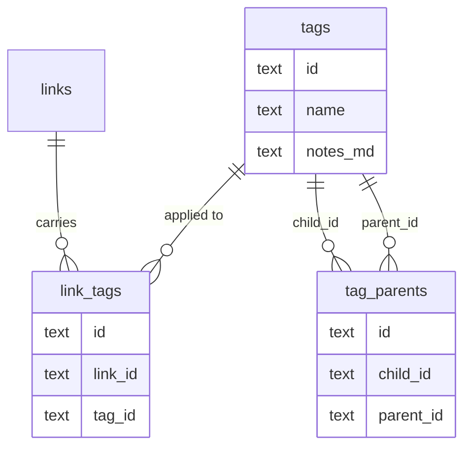

# Tagging

How tags are stored, nested, queried and healed. Companion to
[data-model.md](data-model.md) (the whole schema) and
[sync.md](sync.md) (the sync engine); the design rationale for nesting is in
[experiments & plans/hierarchical-tags.md](experiments%20&%20plans/hierarchical-tags.md).
User-facing behaviour is [docs/user/tagging.md](../user/tagging.md).

## 1. The three tables



| Table | One row per | Notes |
|---|---|---|
| `tags` | a tag | logically one per `lower(name)`, but keyed by a random UUID |
| `link_tags` | (link, tag) assignment | junction; soft-deleted so un-tagging syncs |
| `tag_parents` | (child, parent) nesting edge | junction; soft-deleted so un-nesting syncs |

All three are ordinary synced stores: client-generated `id`, `updated_at` for
last-write-wins, `deleted_at` tombstone, `server_seq` cursor. Nothing about
tagging is special-cased in the sync engine.

### Why `tag_parents` is a table, not a column

A `tags.parent_id` column can express only one parent. The requirement is that
`astro` sits under **both** `javascript` and `webdev`, so tags form a **DAG,
not a tree**. Making parentage a junction table also means it inherits
machinery that already exists and is already tested — `dedupePairs`, tombstone
reads, the re-point pass in `reconcileTags`.

**There is deliberately no closure/materialised-ancestor table.** It would make
reads O(1), but it is *derived* data, and derived data must never sync — §6.1 of
[the sync bug catalogue](experiments%20&%20plans/sync-issues-summary.md) is the
bug where a local-only partition resurrects on pull. If profiling ever demands
one it must be a local-only, rebuildable cache excluded from push/pull the way
`archived_links` is.

## 2. Identity and healing

Tagging carries **three** independent convergence problems, each with its own
reconciler. They run on the read paths that surface the data, and a converged
database writes nothing.

| Problem | Reconciler | Rule |
|---|---|---|
| Two devices create the tag "AI" → two rows, same name | `reconcileTags` ([links.ts](../../frontend/src/lib/services/links.ts)) | smallest id survives; freshest `notes_md` merged; strays tombstoned |
| Two devices tag the same link → two `link_tags` rows, same pair | `dedupePairs` ([repo.ts](../../frontend/src/lib/db/repo.ts)) | smallest id survives |
| Two devices nest the same pair → two `tag_parents` rows | `dedupePairs` via `dedupeEdges` ([tagTree.ts](../../frontend/src/lib/services/tagTree.ts)) | smallest id survives |

Every rule picks a **device-independent** winner (smallest id) so two devices
reach the same answer without coordinating. See the "logical singletons keyed by
UUID" section of [data-model.md](data-model.md) for the family this belongs to.
Survivors persist via `putReconciled`, which preserves `updated_at` — §5
explains why that rule holds for content folds and inverts for structural
re-points.

### Ordering matters

`reconcileTags` must run **before** the per-pair dedupes on any shared read
path. It re-points stray join rows onto the survivor, which is what *creates*
the duplicate `(link_id, survivor)` pairs the dedupe then collapses. Running
them the other way round leaves duplicates behind. `tagsByRecentUse`, the tag
index and the tag page all order it correctly; new read paths must too.

When a tag merge happens, the survivor inherits **four** kinds of row:

- `link_tags` — via `repointTagJoins`
- `tag_parents` — via `repointTagParents`, in **both** directions (the stray may
  be a child in one edge and a parent in another)
- `focus_tag_ids` arrays on `user_settings` and every `plan` — via
  `remapSettingsFocusTags` / `remapPlansFocusTags` (each an alias of its
  module's `remapFocusTags`)
- the stray's `label_usage` recency — via `remapLabelUsage`, which carries the
  fresher `used_at` onto the survivor. This one is a local-only derived cache
  (chip ordering), so it's hard-deleted, not tombstoned

## 3. The nesting graph

[`tagTree.ts`](../../frontend/src/lib/services/tagTree.ts) owns it.

```ts
tagWithDescendants(tagId, maxDepth?)   // the tag + everything beneath it
tagsWithDescendants(tagIds, maxDepth?) // same, many roots, one adjacency build
tagWithAncestors(tagId, maxDepth?)     // the mirror walk
parentsOf(tagId) / childrenOf(tagId)   // direct neighbours, name-sorted
parentIdsOf(tagId)                     // ids only, no name sort
parentMap()                            // child → parents, whole graph at once
setTagParents(childId, parentIds)      // what the picker saves
addTagParent / removeTagParent         // single-edge writes
wouldCycle(childId, parentId)          // UX-only insert check (see below)
repointTagParents(survivor, strays)    // merge support, both directions
reconcileTagParents()                  // repair
```

### Acyclicity cannot be enforced at write time

This is the single most important thing to understand about the design.

A cycle is a property of a *set* of edges. Two devices, each offline, can each
add an individually-legal edge — `astro` under `javascript` here, `javascript`
under `astro` there — and whole-row LWW will keep both, because neither row
conflicts with the other. **No insert-time validation can prevent this**, on any
device, ever. The same argument applies to depth limits.

So the invariant is *maintained*, not *enforced*, in three layers:

1. **`wouldCycle()` at insert time — UX only.** Refuses the ordinary mistake
   given what this device knows, with an immediate error message. Do not rely on
   it for correctness.
2. **Cycle-tolerant traversal — the load-bearing guarantee.** Every walk carries
   a `visited` set and a depth cap (`MAX_TAG_DEPTH = 6`), so corrupt data yields
   a bounded result instead of hanging a page or blowing the stack. `findCycle`
   uses an explicit stack for the same reason: the input is precisely the case
   where recursion is unsafe.
3. **`reconcileTagParents()` — convergence.** Drops the edge with the
   **largest id** in each cycle. Largest-id is device-independent (the mirror of
   the min-id survivor rule), so two devices that both notice the same cycle drop
   the *same* edge and converge — rather than each dropping a different one and
   ping-ponging forever. It also drops self-edges and edges referencing a
   tombstoned tag.

`reconcileTagParents` runs at the top of the tag page and the tags index.

## 4. Query semantics

| Function ([links.ts](../../frontend/src/lib/services/links.ts)) | Returns |
|---|---|
| `linksTaggedDirectly(tagId)` | links carrying exactly this tag — no hierarchy |
| `linksForTag(tagId)` / `linksForTags(ids)` | the tag **plus descendants**, de-duped by link id |
| `linksFromChildTags(tagId)` | links reaching the tag *only* through a descendant, each with the child tags it came via |
| `tagLinkCounts()` | direct counts only |
| `tagCounts()` | `{direct, total}` per tag, `total` counting distinct links across descendants |

### Two de-duplications, easy to conflate

1. **Row-level.** A link reachable by several paths — tagged both `javascript`
   and `astro`, or reachable down two branches of a diamond — must appear
   **once**. Every union is built into a `Map` keyed by link id, never
   concatenated. This is also why `tagCounts().total` cannot be a sum of the
   direct counts down the tree.
2. **Section-level.** On the tag page, a link tagged **both** parent and child
   belongs in **Links**, not in **From child tags**. `linksFromChildTags`
   subtracts the direct set for exactly this reason.

### Chips stay explicit

`tagsForLink` / `tagsForLinks` are **unchanged** by nesting: a link row's chips
show only explicitly assigned tags. Rendering inherited ancestors as chips would
double up visually (`astro` + `javascript` on a link tagged only `astro`) and
make "remove this tag" ambiguous. Inheritance is a *query-time* relation, not a
label on the row.

### Focus tags inherit

`suggestLinks` ([weeks.ts](../../frontend/src/lib/services/weeks.ts)) expands
each focus tag through `tagsWithDescendants`, or focusing `webdev` would
silently ignore the `astro` backlog.

## 5. Things to be aware of

**`put` vs `putReconciled` when re-pointing.** `putReconciled` preserves
`updated_at` and exists so a stale *content* fold cannot clobber a newer edit.
Re-pointing a join or edge row onto a merge survivor is **not** that kind of
write — it is structural and must win. Preserving `updated_at` leaves the
rewritten row tied with its own older copy on the server; the server's `<=` rule
keeps the incumbent and returns it in `pushResponse.Conflicts`, and the client
adopts it straight back, silently undoing the re-point. **Preserve `updated_at`
for content folds; stamp it for structural rewrites.** This bit us building
`repointTagParents`, and only the cross-device test caught it — the unit test
passed because nothing round-tripped through a server.

**Deleting a tag must tombstone its edges in both directions.** `child_id` *and*
`parent_id`, plus its `link_tags`. Leaving them behind strands live rows pointing
at a tombstoned tag on every device — a referential-integrity violation the
harness checks after every convergence.

**Adding a store touches more places than you think.** `tag_parents` needed:
`STORES` + an IndexedDB migration, the backend schema + a migration,
`tableOrder` **and** `tables` metadata in `sync.go` (columns, plus `defaults`
for any NOT NULL column older rows may omit), the scoped export paths,
`TABLE_ORDER`/`TABLES`/`FOREIGN_KEYS` in the harness `meta.ts`, `ALL_STORES` in
the reporter, and a `field-matrix.spec.ts` round-trip. The last two are guards —
the coverage check failed the build until the round-trip existed, which is the
harness working as designed.

**Ordering in `tableOrder`.** `tag_parents` sorts after `tags` so both endpoints
of an edge exist before the edge lands. Same rule as every other junction table.

**Version skew needs a resync, once.** A client that predates the store hits
`if (!(store in STORES)) continue` in the pull loop ([sync.ts](../../frontend/src/lib/sync.ts))
— it skips those rows **and still advances `lastPullSeq` past them** (audit
M23). Nothing is lost server-side, but that client will not see those edges even
after upgrading, because its cursor is already beyond them. The fix is a
one-time `resetLocalSyncState()` — the same mechanism `checkServerEpoch` uses
after a server switch. Worth remembering for any future store addition, not just
this one.

**Scoped exports must not emit dangling edges.** `relatedData` and the tag
template export include only edges whose **both** endpoints are in the exported
tag set; a half-exported edge would import as a dangling reference.

**Depth cap is a real limit.** `MAX_TAG_DEPTH = 6`. A chain deeper than that
silently stops resolving rather than erroring. Far past any real taxonomy, but
it is a cap, not a warning.

**Traversal cost.** `tagCounts()` walks the graph once per tag. Tag counts are
in the hundreds at most, so this is cheap — but it is O(tags × graph), so
resolve once per page load and pass the id set down rather than re-walking per
row. `parentMap()` exists for callers that need the whole graph at once.

## 6. Tests

| Where | Covers |
|---|---|
| `frontend/test/tagHierarchy.test.ts` | traversal (multi-parent, diamond, depth cap), both de-dupes, cycle tolerance, `reconcileTagParents` determinism, merge interaction, focus-tag inheritance |
| `frontend/test/reconcile.test.ts` | tag/topic name-merge |
| `frontend/test/joinDedupe.test.ts` | `link_tags` pair dedupe |
| `frontend/tests/sync/tag-hierarchy.spec.ts` | cross-device: edge propagation, un-nesting, duplicate-pair collapse, **the two-device cycle**, merge re-point, the UI picker, tag deletion cleanup |
| `frontend/tests/sync/field-matrix.spec.ts` | `tag_parents` field round-trip + the coverage guard |
| `backend/sync_test.go` | `tag_parents` round-trip, tombstones, `tableOrder`, and that a cycle is **stored not rejected** (the server cannot judge it) |

The rule from [the harness notes](experiments%20&%20plans/sync-testing-framework.md)
applies: a change is done when its tripwire flips red → green **and** the full
suite stays green with 12/12 sabotage detection. For anything involving a
reconciler, write the cross-device spec — a unit test cannot see a server
round-trip, which is where the `putReconciled` bug above lived.
