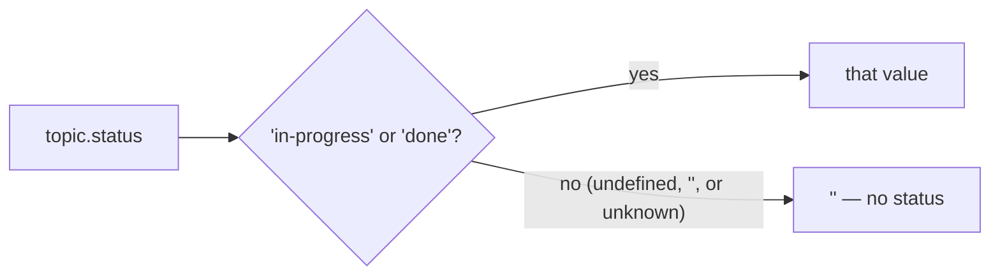
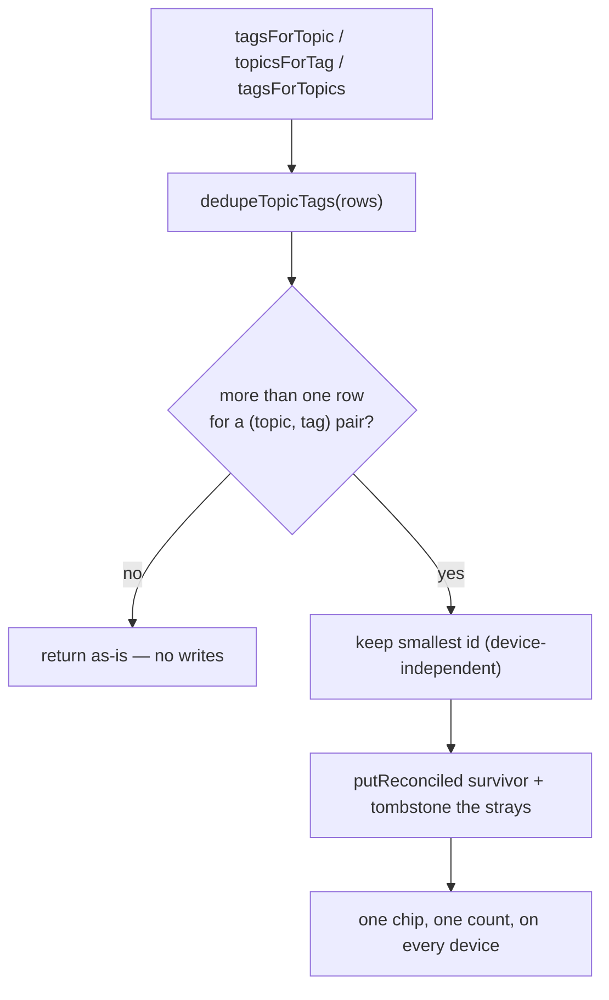

# Topics: statuses, tags, and footnotes

A topic is a long-form document that cites links. Three pieces of state hang
off it, and they are stored in three deliberately different ways:

| State | Storage | Why |
|---|---|---|
| the document | `topics.body_md` | one column, LWW like any other prose |
| references | `link_topics` join, with `ref_number` | numbers are issued once and never recomputed (see [data-model.md](data-model.md)) |
| **status** | `topics.status` (optional column) | one value per topic; `''` means "not set" |
| **tags** | `topic_tags` junction | many-to-many, and healed like `link_tags` |

Footnote numbering is covered in [data-model.md](data-model.md); this document
covers the two that shipped in 0.4.0.

---

## Status

`topics.status` is `'' | 'in-progress' | 'done'`, `NOT NULL DEFAULT ''`
([schema.sql](../../backend/sql/schema.sql), migration v20 → v21 in
[db.go](../../backend/db.go)).

**Empty string, not NULL.** A row pushed by an older client arrives without the
column at all, and the server's default fills it — so there is no `NULL` vs
`''` ambiguity anywhere downstream. It is the same choice `links.is_series`
made, and for the same reason.

**Every read goes through `topicStatus()`**
([topics.ts](../../frontend/src/lib/services/topics.ts)). IndexedDB is
schemaless per record, so a topic written before 0.4.0 has no `status` key at
all; a topic written by some future client could carry a value this one has
never heard of. Both normalize to `''` rather than leaking `undefined` into a
comparison or a template branch:

### Ordering

`statusRank` puts **in-progress (0) → no status (1) → done (2)**. Unmarked sits
*between* the two on purpose: `in-progress` means "weight this up" and `done`
means "finished with it", so pushing the great majority of topics — which
carry neither — below finished work would be backwards.

`orderTopics()` applies that band first and the name second;
`compareTopicsByStatus(a, b, within)` is the reusable form.

### Search and filters

`filterTopics(topics, query)` backs the overview toolbar
([TopicsApp.svelte](../../frontend/src/components/apps/TopicsApp.svelte)):

- `search` matches the topic **name or any of its tag names**;
- `statuses` is **OR** — a topic has exactly one status, so several chips can
  only mean "any of these"; the `none` chip maps to `''`;
- `tagIds` is **AND** — several tag chips narrow down, the way tag filters read
  everywhere else in the app.

Tag names only participate when the caller passes `tagsByTopic`; the helper
never reads the store itself.

---

## Topic tags

`topic_tags` is `{id, topic_id, tag_id}` — structurally identical to
`link_tags`, and that is the whole design: the pair is the logical identity but
the row is keyed by a random UUID, so two devices tagging one topic before
syncing each mint a row that row-level LWW can never merge (the
[singleton-UUID divergence](data-model.md) class of bug).

Every display read therefore runs through `dedupeTopicTags()`, which collapses
a pair to its smallest-id row and heals in place:

### Re-pointing when an endpoint folds

Tags and topics are *themselves* logical singletons keyed by `lower(name)`, so
either endpoint of an edge can be merged away. `repointTopicTags(axis, …)`
([links.ts](../../frontend/src/lib/services/links.ts)) runs on both axes:

| Fold | Called from | Axis rewritten | Grouped by |
|---|---|---|---|
| duplicate **topics** merge | `reconcileTopics` | `topic_id` | `tag_id` |
| duplicate **tags** merge | `reconcileTags` | `tag_id` | `topic_id` |

Grouping by the *other* endpoint is what finds the rows that become the same
pair once this axis is rewritten; they collapse to the smallest id and the rest
are tombstoned, so a merge on either side can never leave the
`topic_tags-pair` invariant violated.

It uses `put`, not `putReconciled` — re-pointing an edge is a structural change
that has to win, exactly as `repointTagParents` argues at length. Nobody edits
an edge's endpoints concurrently, so there is no newer content to protect.

`reconcileTopics` also **carries `status` onto the survivor**, using the same
rule as prose: a real status beats `''`, and newest wins between two real ones.
Without it, merging an `in-progress` duplicate into an unmarked survivor would
silently drop the status set on the other device.

### Deletion cascades

Both endpoints cascade, or the edges become live rows pointing at a tombstone —
the referential violation the sync harness checks after every convergence:

- deleting a **topic** → `clearTopicTags(topicId)`
  (`TopicApp`, `TopicsApp`, and the bulk panel);
- deleting a **tag** → `clearTagFromTopics(tagId)` (`TagsApp`), alongside the
  existing `link_tags` and `tag_parents` cascades.

---

## Where it surfaces

| Surface | What it does |
|---|---|
| [TopicsApp](../../frontend/src/components/apps/TopicsApp.svelte) | search, status + tag chip filters, per-row ▶/✓ toggles, tag chips, bulk selection |
| [TopicBulkPanel](../../frontend/src/components/TopicBulkPanel.svelte) | set/clear status, add/remove tags, delete — the `BulkActionsPanel` shape for topics |
| [TopicApp](../../frontend/src/components/apps/TopicApp.svelte) | ▶ In progress / ✓ Done toggles in the header, a **Tags** card |
| [TagPicker](../../frontend/src/components/TagPicker.svelte) | now takes `linkId` **or** `topicId` — same junction shape, same interaction, three swapped function references |
| [TagApp](../../frontend/src/components/apps/TagApp.svelte) | a **Topics** section listing topics carrying the tag, with their status |
| [topicExport.ts](../../frontend/src/lib/services/topicExport.ts) | YAML frontmatter (md) / a metadata card (HTML), both omitted when there is neither status nor tags |
| [export-markdown.ts](../../frontend/src/lib/db/export-markdown.ts) | the same frontmatter in the bulk markdown export |
| [export.ts](../../frontend/src/lib/db/export.ts) | `topic_tags` in full, curated, range and (tags+topics) template scopes — only ever with **both** endpoints, or the edge would import dangling |

The status toggles are *cycles*: clicking the active status clears it, so one
control both sets and unsets without a per-row "clear" button.

---

## Tests

- [topicStatusTags.test.ts](../../frontend/test/topicStatusTags.test.ts) —
  normalization, `setTopicStatus` no-op behaviour, ordering, assignment,
  pair-dedupe, both re-point axes, cascades, export scopes, overview
  search/filter.
- [versionSkew.test.ts](../../frontend/test/versionSkew.test.ts) — a backend
  that predates `status` must not erase it, and `topic_tags` simply stays
  local until the backend is rebuilt.
- [topicExport.test.ts](../../frontend/test/topicExport.test.ts) — frontmatter
  and metadata-card structure, including "no metadata → unchanged output".
- Harness: `store:topics status` and `store:topic_tags` in
  [field-matrix.spec.ts](../../frontend/tests/sync/field-matrix.spec.ts), the
  `topic_tags-pair` invariant in
  [invariants.ts](../../frontend/tests/sync/helpers/invariants.ts), and the
  store in `meta.ts` / `reporter.ts` (coverage is 18/18).
