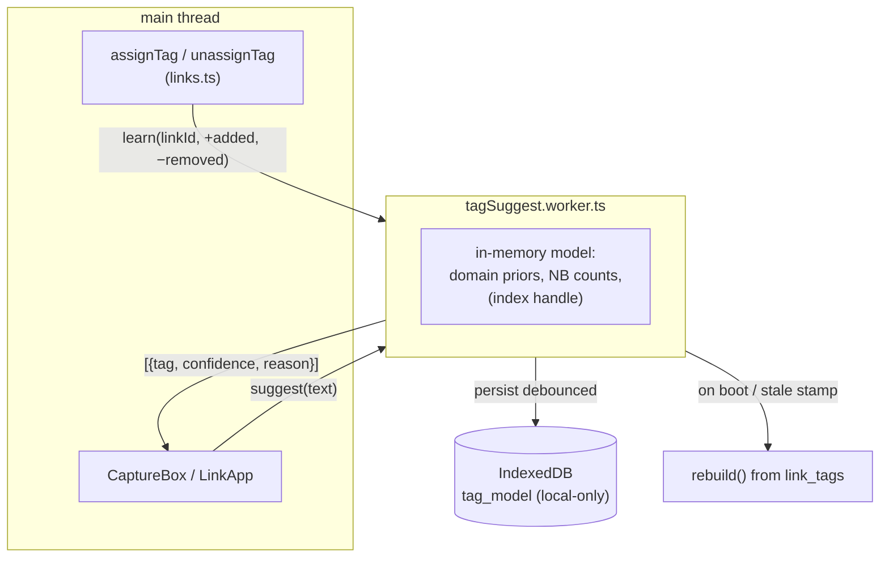

# Automatic tag suggestions

A system that proposes tags for a link — at capture time and on the link
page — learned entirely from how *you* have tagged things before, running
**100% in the browser**. No server call, no content leaving the device, no
mandatory model download, works offline. It must feel like an
autocomplete that got smart, not like an AI feature bolted on.

This is a design plan, not shipped code. It fits the app's grain: local-first
([../offline-support.md](../offline-support.md)), incremental, explainable,
and cheap by default with an optional heavier tier for people who want it.

## 1. Goal and hard constraints

Suggest the handful of existing tags most likely to apply to a link, ranked,
each with a one-line reason, so the user accepts with a tap instead of typing.

Non-negotiables (they eliminate most of the obvious approaches):

- **On-device only.** No LLM API, no server inference. Content is private and
  the app must keep working with the sync server absent (it usually is).
- **No mandatory download.** The default tier ships as plain TypeScript — a
  few KB — not a 20–90 MB model. Heavy models are strictly opt-in.
- **Suggest, never auto-apply.** A wrong auto-tag erodes trust instantly; a
  wrong *suggestion* is just ignored. Precision ≫ recall.
- **Incremental.** Every tag the user adds/removes updates the model in O(one
  link); no full retrain on the hot path.
- **Explainable.** "Because 6 similar links are tagged `rust`" is a feature —
  it makes the suggestion trustworthy and debuggable.
- **Scales** to tens of thousands of links and hundreds of tags (see
  [../data-model.md](../data-model.md) volume table) without janking the UI.

## 2. Signals already on hand

Every link already carries text we can mine — no new capture step:

| Signal | Availability | Strength | Notes |
|---|---|---|---|
| `title` | ~always (auto-resolved) | high | the primary content signal |
| domain | always | high | strong prior (`github.com` → `code`) |
| URL path tokens | always | medium | `/rust-lang/` etc. |
| `notes.body_md` | ~7/week of links | high when present | rich but sparse |
| `excerpts.content_md` | sparse | high when present | quoted passages |
| existing tags on the link | after first tag | high | drives co-occurrence |
| topics on the link | sparse | medium | another label channel |

The **training set is `link_tags`** ([../data-model.md](../data-model.md)):
every join row is one labeled example. It grows monotonically and is
user-specific — this is per-user multi-label text classification over an
evolving label set, which is exactly what makes a *local* model viable (the
corpus is small, personal, and already on disk).

## 3. Design: a layered ensemble, cheap tiers first

```mermaid
flowchart LR
    L["new / viewed link<br/>title + domain + path (+ notes)"] --> TOK["tokenize()<br/>lowercase, split, stop-words,<br/>dom:github.com as a token"]
    TOK --> T0["Tier 0 — heuristics<br/>direct name match +<br/>domain→tag prior"]
    TOK --> T1["Tier 1 — statistics<br/>kNN over the search index +<br/>incremental Naive Bayes"]
    TOK -. opt-in .-> T2["Tier 2 — semantic<br/>embeddings → tag centroids<br/>(transformers.js, lazy)"]
    T0 --> BLEND["blend + calibrate → ranked<br/>(tag, confidence, reason)"]
    T1 --> BLEND
    T2 -. .-> BLEND
    BLEND --> UI["top ~5 above threshold<br/>shown as one-tap chips"]
```

### Tier 0 — heuristics (works from link #1, no model)

Two rules that need essentially no training and give instant value:

- **Direct name match.** If a tag's name (or a light variant — case-fold,
  singular/plural) appears as a token in the title/URL, that's a strong,
  high-precision signal. A `rust` tag and a title containing "rust" → suggest.
- **Domain prior.** Maintain `domain → {tag → count}` from history: if 80% of
  your `youtube.com` links got `video`, suggest `video` for a new YouTube
  link. It's just a co-occurrence tally, updated on every tag change.

Tier 0 alone is genuinely useful and can ship first (§12, phase A) with no
worker and no persistence beyond a small counts table.

### Tier 1 — token statistics (the workhorse)

Two complementary models over the tokenized text:

- **kNN over the search index (primary).** The scaling plan already calls for
  a MiniSearch index of `title + url + tag names` in a web worker (for
  search). Reuse it: query it with the new link's tokens, take the top *K*
  already-tagged neighbours with similarity `s_i`, and for each candidate tag
  compute a similarity-weighted vote:

  ```
  confidence(tag) = Σ s_i over neighbours carrying tag
                    ─────────────────────────────────────
                    Σ s_i over all K neighbours
  ```

  This is naturally in `[0,1]`, directly comparable across tags, trivially
  explainable ("6 of your 8 most-similar links are tagged `rust`"), and needs
  no bespoke training — the index is the model. Neighbour tags come from
  `byIndex('link_tags', 'link_id', …)` per hit (~K lookups).

- **Multinomial Naive Bayes (complement / cold-start).** Maintain, per tag
  `t`: document count `D_t` and per-token counts `c(w,t)`. Score a link's
  token bag with add-α smoothing:

  ```
  score(t) = log D_t + Σ_w tf(w) · log( (c(w,t)+α) / (T_t + α·V) )
  ```

  Rank and threshold. NB shines where kNN is weak (a tag with few but
  textually-tight examples) and updates in O(tokens) when a tag is
  added/removed (just adjust counts). Its raw scores aren't comparable across
  tags, so they're rank-normalized before blending.

### Blend and calibrate

A small linear blend of the tier scores with tunable weights, plus the Tier-0
signals as additive boosts, then a single **confidence threshold** that
favours precision. Start dead simple (`0.6·kNN + 0.4·NB`, `+0.3` direct
match, `+0.2·domainPrior`); tune the weights and threshold on the eval
harness (§8). Cap output at ~5 chips and suppress anything below the floor —
showing nothing is better than showing noise.

### Tier 2 — semantic embeddings (optional, opt-in)

For power users who want synonym/concept matching ("golang" → `programming`
without the literal word): `transformers.js` running a small quantized
sentence model (e.g. `bge-small` / `all-MiniLM-L6-v2`, WASM with WebGPU when
available). Embed each link's text; keep a **centroid vector per tag** (mean
of its members' embeddings, updated incrementally); suggest by cosine
similarity to centroids.

It stays strictly behind a Settings toggle because it costs a ~20–90 MB model
download (cached after first use), a few seconds of first-run warmup, and
meaningful memory — and Tiers 0–1 already capture most of the value. It must
degrade to Tier 1 when the model isn't downloaded, WebGPU/WASM is
unavailable, or the user is offline before the first fetch.

## 4. Runtime and storage



- **Web worker** (`tagSuggest.worker.ts`) so scoring never blocks paint —
  same pattern the scaling plan uses for search. Message API:
  `suggest({ title, url, notesText? }) → Suggestion[]`,
  `learn({ linkId, added, removed })`, `rebuild()`.
- **Local-only IndexedDB store** `tag_model` (created in an append-only
  migration in [../../frontend/src/lib/db/db.ts](../../frontend/src/lib/db/db.ts),
  **not** in `STORES`, like `sync_meta`/`sync_log`). It holds the serialized
  domain-prior table and NB counts, plus a **data-version stamp** (row count +
  max `updated_at` of `links`/`link_tags`). Never synced, excluded from
  backups — the whole thing is derivable from `link_tags`, so a stale or
  missing model just triggers `rebuild()`.
- **Rebuild** is one worker pass over `link_tags` + `links` (seconds even at
  scale); it runs on first use, when the stamp drifts (e.g. after a sync pull
  or a backup import), and never on the UI hot path.

## 5. The learning loop

Tagging *is* the training signal — no separate labelling step:

- `assignTag` / `unassignTag` in
  [../../frontend/src/lib/services/links.ts](../../frontend/src/lib/services/links.ts)
  post a `learn` message (added/removed tag ids for a link). The worker
  updates domain priors, NB counts, and the search index incrementally, then
  debounce-persists.
- **Feedback weighting:** accepting a suggested chip is a strong positive
  (it's a normal tag assignment); explicitly dismissing a suggestion is a
  weak negative we can log to demote that (tag, token) pairing; simply not
  acting is neutral — never penalize silence.
- **Cold start:** below a per-tag example floor (say `D_t < 3`) a tag is
  Tier-0-only (name/domain match), and with a near-empty corpus the panel
  simply shows nothing. Suggestions get better as the library grows, which is
  the right failure mode.

## 6. UX and integration

- **Capture box** ([../../frontend/src/components/CaptureBox.svelte](../../frontend/src/components/CaptureBox.svelte)):
  a "Suggested" row of tappable chips under the existing tag chips, populated
  once a link's title resolves (titles arrive async — recompute then). Tapping
  a chip adds the tag exactly as a manual selection would.
- **Link page** (`LinkApp`): the same suggested-chips affordance beside the
  tag picker, for retro-tagging older links.
- **Batch paste:** suggestions are per-link, so for a multi-line paste they
  surface on the "Just Added" rows rather than the shared chip box.
- **Relationship to the DSL** ([../link-dsl.md](../link-dsl.md)): suggestions
  *propose* tags; the user still applies them (tap, or `!tags=[…]`). The DSL's
  autocomplete and this suggester are cousins — both narrow a large tag set —
  but one completes what you type and the other predicts from content.

## 7. Evaluation

A dev-only harness (vitest, `fake-indexeddb`, seeded corpus): hold out the
tags on a random sample of already-tagged links, ask the model to predict
them, and report **precision@k / recall@k** and the accept-threshold's
precision/recall curve. Tune the blend weights and threshold here, favouring
precision. One trap to guard against: the eval must strip held-out tag *names*
from the input text, or direct-match leaks the answer.

## 8. Scale and performance

- kNN cost is the index query (already bounded by the search plan) + ~K
  `link_tags` lookups. NB scoring is O(tokens · candidate tags), tiny.
- Persisted model size: domain priors are O(domains × tags-per-domain); NB
  counts are O(vocab × tags) but sparse — single-digit MB at 78k links /
  hundreds of tags. Well inside IndexedDB budgets.
- Everything heavy lives in the worker; the main thread only sends text and
  renders chips. Rebuild is off the hot path and idempotent.

## 9. Rejected alternatives

- **Server-side / LLM-API inference** — sends private content off-device,
  needs the network and (for LLMs) money, and breaks offline. Kills the
  local-first guarantee for a feature that doesn't need it.
- **TensorFlow.js / a full ML framework** — megabytes of bundle for what
  hand-rolled NB + kNN do in a few KB, with worse explainability.
- **Bundling an embedding model by default** — bloats first load for value
  the cheap tiers mostly already deliver; hence Tier 2 is opt-in.
- **Auto-applying high-confidence tags** — one bad auto-tag costs more trust
  than a hundred good suggestions earn. Always human-in-the-loop.
- **A brand-new labelling UI** — unnecessary; `link_tags` is already a clean,
  growing, supervised dataset.

## 10. Non-goals

- Suggesting **topics** (a heavier, longer-form label — possible future work,
  not this system) or auto-filing into resource lists.
- Entity extraction / summarization — this ranks *existing* tags, it doesn't
  invent taxonomy. (Proposing a brand-new tag name is a stretch goal, gated
  hard on precision.)
- Cross-device model sharing — the model is derivable and device-local by
  design; each device rebuilds from the synced `link_tags`.

## 11. Rollout

| Phase | Trigger | Work |
|---|---|---|
| **A — heuristics** | anytime; high value, near-zero cost | Tier 0 (direct-match + domain-prior) with a small `tag_model` counts table; suggested-chips row in the capture box; `learn` hook on assign/unassign. No worker required yet. |
| **B — statistical** | once the search-index worker (scaling plan) exists | Move scoring into `tagSuggest.worker.ts`; add kNN-over-index + incremental NB; blend + calibrated threshold; eval harness; LinkApp integration. |
| **C — semantic (opt-in)** | user demand for concept/synonym matching | `transformers.js` embeddings tier behind a Settings toggle, lazy-loaded, WebGPU-when-available, graceful fallback to Tier B. |

Each phase is independently shippable and adds no wire-format, schema, or sync
change — `tag_model` is a local-only derived store, exactly like the archive
and sync-log stores ([../data-model.md](../data-model.md)).
