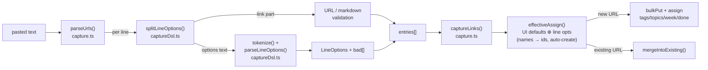
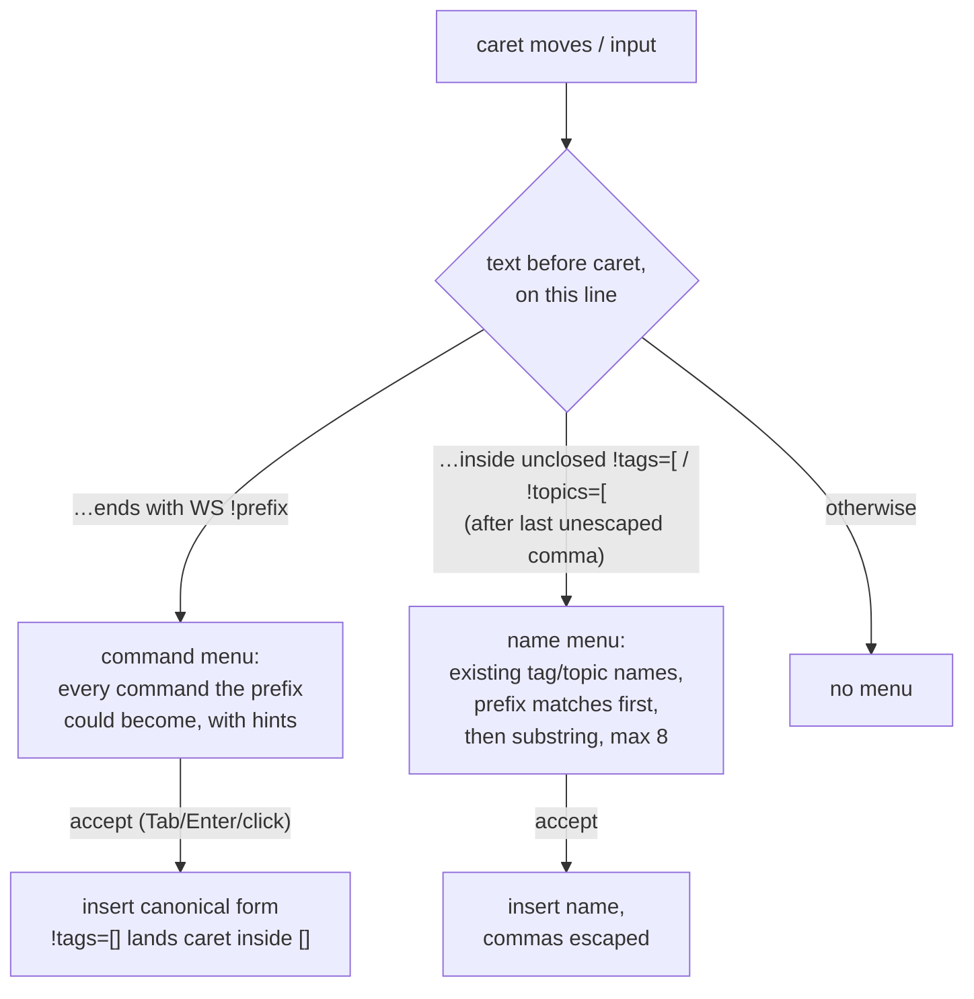

# The link DSL

Every capture box in readerr accepts per-line **!options** after a pasted
link, so a batch paste can tag, flag, and schedule each line differently:

```
- [The Untold Story of SSH](https://www.youtube.com/watch?v=1UX_iTdrtbc) !tags=[security, history] !week=0
https://github.com/Poseidon-fan/linux-0.11-rs !tags=[linux,os, really\,rusty] !resource !done
https://example.com/article !ta=false !clean=false !w=false
```

This document covers the grammar, the semantics, the autocomplete, and where
each piece lives in the code.

## Grammar

```
line       := <link-part> ( WS option )*
link-part  := URL | "-" WS URL | "*" WS URL | "•" WS URL
            | markdown | bullet markdown          where markdown = "[" title "](" URL ")"
option     := "!" command [ "=" value ]           bare command (no "=") means true
command    := any prefix of a full command word, at least the minimum:
              ta(gs)  to(pics)  f(avourite)  d(one)  r(esources)  c(lean)  w(eeks)
value      := array | bool | int
array      := "[" item ( "," item )* "]"          items whitespace-trimmed
bool       := true | 1 | yes | false | 0 | no     (case-insensitive)
```

Rules that make it unambiguous:

- **Options must follow whitespace.** The options region starts at the first
  whitespace-separated `!` token *after* the link part, so a `!` inside a URL
  or a markdown title never triggers parsing, and a line can't *start* with
  an option (a link must come first).
- **Commands match by prefix**, case-insensitively: `!ta`, `!tag`, `!tags`
  all mean tags. A bare `!t` is ambiguous (tags? topics?) and rejected.
- **`\` escapes the next character** inside arrays — `\,` is a literal comma
  in a tag name (`really\,rusty` → `really,rusty`); `\]` and `\\` work too.
- **Line-scoped.** Options never affect other lines.

### Commands

| Command | Min | Value | Meaning |
|---|---|---|---|
| `!tags` | `!ta` | array, or `false` | tag names to add, **merged** with the UI-selected chips; `false` (or `[]`) excludes the UI selection for this line |
| `!topics` | `!to` | array, or `false` | same, for topics |
| `!favourite` | `!f` | bool (bare = true) | favourite the link |
| `!done` | `!d` | bool (bare = true) | mark read on capture (joins the current week as done) |
| `!resources` | `!r` | bool (bare = true) | flag as a resource |
| `!clean` | `!c` | bool (bare = true) | override URL cleaning: `false` keeps the URL raw; `true` forces cleaning on (configured mode, else trackers) |
| `!weeks` | `!w` | int 0–52, or `false` | weeks ahead to schedule (`0` = this week); `false` = backlog only |

Unknown tag/topic **names are auto-created** (case-insensitive match against
existing names first). `!w` digits win over the boolean short forms — `!w=0`
is *this week*, not "no week"; only the words `false`/`no` opt out.

### Semantics: layering over the UI

Each line resolves to an *effective assignment*: the capture box's UI
selections (chips, week dropdown, toggles) are the batch defaults, and the
line's options are layered on top — tags/topics **merge**, everything else
**overrides**. Malformed or unknown options never fail a line: they're
collected as `badOptions` and surfaced in the capture report
("2 options not understood (!tgas=[x] !w=99)") while the link still captures.

If the URL **already exists**, the line's effective assignment merges into
the existing link instead of creating a duplicate: tags/topics append, flags
only ever upgrade, and a selected week the link was never part of adds it as
a `review` entry.

## Implementation



- **[captureDsl.ts](../frontend/src/lib/services/captureDsl.ts)** — the pure
  parser. `splitLineOptions` finds where the link ends (closing paren for
  markdown, first whitespace otherwise) and only treats the remainder as
  options if it starts with `!`. `tokenize` splits on whitespace *except
  inside `[...]`* (arrays may contain spaces), with `\` escorting the next
  character through. `parseLineOptions` resolves each token against the
  command table and produces `{ opts: LineOptions, bad: string[] }`.
- **[capture.ts](../frontend/src/lib/services/capture.ts)** — `parseUrls`
  strips bullets, splits off options, validates the URL, and attaches `opts`
  to each entry. `captureLinks` computes the per-line `effectiveAssign`
  (resolving names via `ensureTagIdsByName`/`ensureTopicIdsByName` in
  [links.ts](../frontend/src/lib/services/links.ts), which auto-create),
  applies per-line URL cleaning, then either creates the link or merges into
  an existing one.
- **Week numbers** become concrete Mondays via
  `weekStartPlus(currentWeekStart(), n)` and go through the normal
  `setLinkWeek` path, so a link still sits in at most one upcoming week.

One behavioral interaction to know: `!done` combined with a *future* `!week`
follows `markLinkDone`'s rule — a done link counts toward the **current**
week, so the future assignment moves to today rather than completing a week
that hasn't started.

## Autocomplete

The capture box suggests as you type, in two contexts:



- **[dslSuggest.ts](../frontend/src/lib/services/dslSuggest.ts)** is a pure
  function `dslSuggestions(text, caret, tagNames, topicNames)` returning
  `{ label, hint, insert, start, caretOffset }[]`. The two regexes mirror
  the parser's rules exactly — including the *must-follow-whitespace* rule,
  so a `!` at the start of the textbox or of a line (never valid DSL)
  suggests nothing.
- **[CaptureBox.svelte](../frontend/src/components/CaptureBox.svelte)** owns
  the menu UI: it tracks the caret (`selectionStart` on input/click/keyup),
  derives suggestions from the tag/topic lists it already loads for its
  chips, and renders the `.dsl-menu` listbox. Keyboard handling composes
  with the box's existing behavior: while the menu is open, `↑`/`↓` select,
  `Tab`/`Enter` accept, `Esc` dismisses until the next keystroke — and
  **Enter only submits the capture when the menu is closed**.
- **Insertion** replaces `[start, caret)` with `insert` and re-places the
  caret at `start + insert.length + caretOffset` (`-1` puts it inside
  `!tags=[]`'s brackets). The caret is set **after `await tick()`** — setting
  it before Svelte flushes the bound value gets clobbered back to the end.

Command insertions are canonical: `!tags=[]`, `!topics=[]` (caret inside),
`!favourite`, `!done`, `!resource`, `!clean=false` (the common use), and
`!week=` (caret after `=`).

## Tests

- [captureDsl.test.ts](../frontend/test/captureDsl.test.ts) — grammar: spec
  examples, escapes, short forms, `!w` digits-vs-false, bad-token
  collection, plus an end-to-end capture asserting what lands in IndexedDB.
- [captureEntry.test.ts](../frontend/test/captureEntry.test.ts) — all six
  line shapes (`url`, `[t](url)`, `-`/`*` bullets of each) × with/without
  options, plus a mixed-batch capture.
- [dslSuggest.test.ts](../frontend/test/dslSuggest.test.ts) — autocomplete:
  prefix narrowing, caret placement, after-comma completion, comma escaping,
  the whitespace-trigger rules.

Run with `cd frontend && npm test`.
