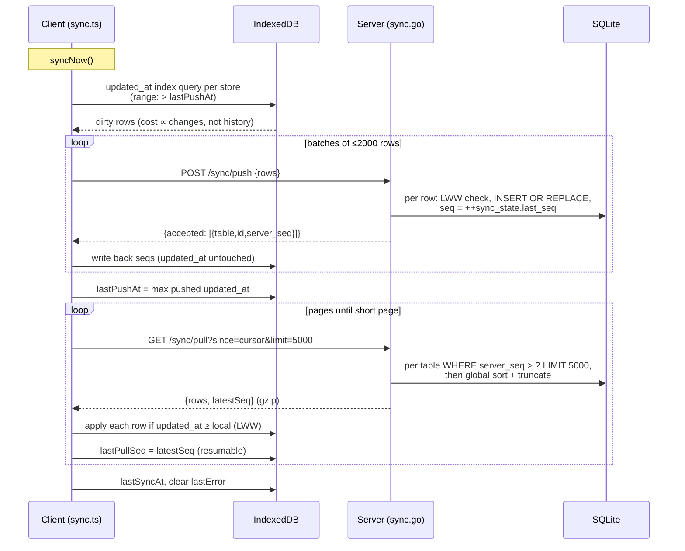

# Sync

readerr is **local-first**: everything lives in your browser's IndexedDB and
the app is fully functional with no server at all. Syncing is optional — a
small Go backend acts as a backup target and a hub that keeps multiple
devices converging on the same data. This document covers every sync-related
feature, then the protocol and implementation for developers.

Code: client engine in [frontend/src/lib/sync.ts](../frontend/src/lib/sync.ts),
server in [backend/sync.go](../backend/sync.go). Related docs:
[data-model.md](data-model.md) (what syncs), [offline-support.md](offline-support.md).

## The model in one paragraph

Each device holds a complete copy of the data. A sync is a **push** followed
by a **pull**: the device sends every row it created or changed since its
last push; the server accepts each row under **last-write-wins** (the row
with the newer `updated_at` timestamp wins, per row — not per field) and
stamps it with the next value of a single global counter (`server_seq`). The
pull then asks for "everything past the counter value I last saw", and
applies those rows locally under the same last-write-wins rule. Deletions
sync too: deleted rows become *tombstones* (marked with `deleted_at`, not
removed), so a delete on one device propagates to the others.

What this means in practice:

- **Edits never block.** There are no sync conflicts to resolve by hand; if
  the same item was edited on two devices, the most recent edit wins.
- **Notes are safe from flag flips.** Long-form notes live in their own rows,
  so favouriting a link on your phone can't clobber the note you're writing
  on your desktop.
- **Order doesn't matter.** Devices can sync in any order, any number of
  times; everyone converges on the same state.

## Modes

- **Sync mode** (default): background sync runs once per browser session and
  then at most every 15 minutes as you navigate
  (`maybeAutoSync` in sync.ts), plus whenever you hit **Sync now**. The
  backend also resolves page titles for captured links.
- **Offline mode** (chosen in onboarding): no network calls, ever. You can
  opt back in at any time by entering a server URL in Settings.

The mode and server URL live in localStorage (`readerr-sync-mode`,
`readerr-sync-url`), not in synced settings — they're per-device by nature.

## Setting up a server

The backend is a single binary (or Docker container) with an SQLite file:

```
DB_PATH=readerr.db PORT=8080 ./readerr
```

Point the app at it under **Settings → Sync**:

- **Blank URL = same origin.** If the backend serves the built frontend
  (the Docker image does), leave the URL empty.
- Otherwise enter it explicitly, e.g. `http://192.168.1.10:8080`.
- **Test connection** probes the server's `/healthz` and explains common
  failures (wrong path, proxy in the way, server down) in plain terms
  (`describeStatus` in sync.ts).

There is **no auth** — the server trusts its network. Run it on a LAN or
behind whatever access control you already trust (VPN, reverse proxy).

## Onboarding with an existing server

If you already run a backend and are setting up a new device, choose
**Sync from existing server** on the very first onboarding screen, enter the
URL, and hit *Connect & sync*. The device pulls everything — links, notes,
tags, topics, weeks, plans, settings — and lands you on the Reading List.
(Onboarding steps can also be deep-linked: `/onboarding?page=2`. A backup
JSON file can be imported from the same screen.)

## Pointing at a new server: conflict options

Entering a **different** server URL in Settings makes the app probe both
sides (`serverHasData` via `GET /sync/stats`, `localHasData` over the local
stores). Depending on what it finds:

- **Server empty:** your local data simply pushes up. Nothing to decide.
- **Local empty, server has data:** the server copy downloads. This is the
  default — a fresh device just adopts the existing dataset.
- **Both sides have data:** a panel asks you to choose:

  | Option | What happens | Implementation |
  |---|---|---|
  | **Merge both** (recommended) | Server data downloads, combines with local under last-write-wins per item, and the result pushes back. | `resetLocalSyncState()` then a normal `syncNow()` |
  | **Use server data** | This device is wiped (including local-only data like archived links) and replaced with the server copy. Confirms first. | `wipeLocalData()` then `syncNow()`, then reload |
  | **Use local data** | The **server** is wiped and repopulated with this device's copy. Other devices syncing to it will converge on this dataset. Confirms first. | `resetServer()` (`POST /sync/reset`) + `resetLocalSyncState()` + `syncNow()` |

Switching servers always resets the device's sync bookkeeping —
`resetLocalSyncState()` nulls every row's `server_seq` (they were assigned
by the *old* server's counter) and drops both cursors — so the first sync
against the new server exchanges complete datasets rather than assuming
shared history. UI lives in
[SettingsApp.svelte](../frontend/src/components/apps/SettingsApp.svelte)
(`saveSyncUrl` / `resolveConflict`).

## Sync history & status

**Settings → Sync** shows the last sync time or the last error (with an
explanation of what the HTTP status likely means). Below it, the
**Sync history** accordion keeps a local log
([syncLog.ts](../frontend/src/lib/services/syncLog.ts), local-only
`sync_log` store):

- **Track errors**: all errors, only *explicit* errors (failures while your
  device was simply offline are ignored), or none.
- **Keep history for N days** (default 30) — older events are pruned
  automatically.
- **Track successful syncs too** — off by default; background sync runs on
  nearly every page load, so success rows accumulate fast.
- A stat line always tracks totals (errors, successful syncs, last synced)
  in localStorage even when event logging is off; the log paginates at 30.

The history never syncs and is excluded from backups — it's device-local
diagnostics.

## Backups vs sync

Sync is not a backup — a bad edit propagates everywhere. For real backups:

- **Settings → Backup → Export JSON** — a complete client-side snapshot
  (tombstones included); importing one replaces all local data.
- **`GET /backup`** on the server — downloads the SQLite file itself.
- **Export Markdown** — every topic, tag, and link as plain markdown files.

Importing a backup **drops the push cursor** (`importData` in
[export.ts](../frontend/src/lib/db/export.ts)), because imported rows carry
historical `updated_at` values the dirty-tracked push would otherwise skip —
the next sync re-scans and re-pushes everything once, and the server
LWW-ignores whatever it already has.

---

# The protocol (developer reference)

## Wire format

**`POST /sync/push`** — body `{ rows: { <table>: Row[] } }`. The server
walks tables in parent-before-child order, and for each row: skips it unless
`updated_at` is *strictly newer* than what it holds (LWW), otherwise
`INSERT OR REPLACE`s it stamped with the next `server_seq`. Response:
`{ accepted: [{table, id, server_seq}], latestSeq }`.

**`GET /sync/pull?since=N&limit=M`** — every row (tombstones included) with
`server_seq > N`. With `limit`, the M rows with the **globally smallest**
seqs come back and `latestSeq` is the last of them; without it, everything
(older-client compatible). Response: `{ rows: {table: Row[]}, latestSeq }`.

Booleans travel as JSON booleans and are stored as SQLite INTEGER 0/1;
array fields (e.g. `focus_tag_ids`) travel as JSON arrays and are stored as
JSON text — the `boolCols`/`jsonCols` sets in sync.go's `tables` map drive
the conversion both ways (`toDBValue`/`fromDBValue`).

## A full sync, end to end



## Transport bounds (scaling.md §4, shipped)

- **Dirty-tracked push.** Every synced store has an `updated_at` IDB index
  (migration v7 in [db.ts](../frontend/src/lib/db/db.ts)); push queries
  `IDBKeyRange.lowerBound(lastPushAt, exclusive)` instead of scanning whole
  stores. Rows the server has never seen have recent `updated_at` by
  construction; the import exception is handled by the cursor drop above.
- **Chunked push** (`PUSH_CHUNK = 2000`). Batch boundaries preserve the
  parent-before-child store order. Accepted seqs are written back per batch;
  `lastPushAt` only advances after *all* batches land, so a mid-push failure
  re-sends the remainder next time — harmless because LWW is idempotent.
- **Paged pull** (`PULL_LIMIT = 5000`). The client loops until a page comes
  back short, persisting `lastPullSeq` per page so an interrupted first sync
  resumes. Server-side, seqs interleave across tables, so a bounded page
  must be the *globally* smallest M — each table is queried with
  `LIMIT M`, then the union is sorted by seq and truncated. Any row cut by a
  per-table LIMIT has a larger seq than at least M returned rows, so
  `latestSeq` can never skip past it.
- **gzip** on `/sync/pull` responses (stdlib middleware in
  [main.go](../backend/main.go)); `/backup` stays plain because
  `http.ServeFile`'s Content-Length/range handling doesn't mix with
  streaming compression.

## Cursors and bookkeeping

Client-side, in the local-only `sync_meta` store:

| Key | Meaning |
|---|---|
| `lastPushAt` | max `updated_at` ever successfully pushed; the dirty-scan floor |
| `lastPullSeq` | `server_seq` high-water mark pulled so far |
| `lastSyncAt` / `lastError` | status for the Settings page |

Server-side, one row: `sync_state.last_seq`, the global counter. Rows also
carry their assigned `server_seq`, which is *server-specific* — hence the
nulling in `resetLocalSyncState()` when the device changes servers.

A subtlety worth knowing: pulled rows are written locally with their
original `updated_at`, which may be newer than `lastPushAt` — so the next
push echoes them back once. The server's strict-newer LWW check drops the
echo; it costs a little bandwidth, never correctness.

## Endpoint reference

| Endpoint | Purpose |
|---|---|
| `GET /healthz` | Liveness probe (used by *Test connection*). |
| `POST /sync/push` | Accept client rows (LWW, stamps `server_seq`). |
| `GET /sync/pull?since=N&limit=M` | Rows past the cursor, optionally paged; gzip'd. |
| `GET /sync/stats` | `{latestSeq}` — cheap "does this server have data?" probe. |
| `POST /sync/reset` | Wipe all server data and restart the sequence (the *Use local data* option). |
| `GET /backup` | Download the server's SQLite file (WAL-checkpointed first). |
| `GET /title?url=…` | Server-side page-title fetch for captured links. |
| `GET /dbsize` | Server database size in bytes (shown on the Stats page). |

## Tests

[backup.test.ts](../frontend/test/backup.test.ts) drives `importData` +
`syncNow` against an in-memory fake server that mirrors sync.go's LWW/seq/
limit semantics, over three backup fixtures — it pins the import↔push-cursor
interplay and the count parity between client and server.

## Troubleshooting

- **"Cannot reach the sync server"** — check the URL, that the server is
  running, and that nothing (firewall, VPN) is between you and it. Offline
  failures are expected and harmless; sync retries on the next interval.
- **404 on sync** — the URL points at something that isn't a readerr
  backend (a plain web server, or a stale URL after moving servers).
- **400 on push** — app and server versions likely disagree; update both to
  the same version.
- **A device shows old data** — open Settings and hit **Sync now**;
  background sync is throttled to every 15 minutes.
- **Moved to a new server and data didn't transfer** — configure the new
  URL in Settings and pick a conflict option; don't copy browser data
  around by hand.
